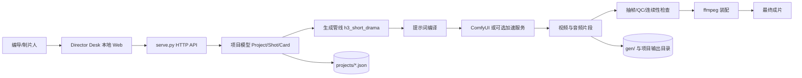

# aiDirector 项目框架与逻辑分析

## 一句话定位

aiDirector 不是单纯的视频生成脚本，而是一个「结构化短剧生产操作系统」：用项目 JSON 固化创作状态，用规则门禁控制输入质量，用提示词编译器连接 H3，用异步任务连接 ComfyUI，最后通过连续性策略和 ffmpeg 装配成片。

## 一、总体架构



系统分为四层：

| 层 | 主要代码 | 作用 |
|---|---|---|
| 交互层 | `director/index.html`、`director/assets/app.js`、`panels.js` | 以 10 个阶段组织工作流，展示状态、表单、媒体和任务进度。 |
| 服务编排层 | `director/serve.py` | 提供 HTTP API，读写项目，调度检查/生成/QC/装配，并管理后台任务。 |
| 领域管线层 | `output/scripts/h3_short_drama/` | 定义项目和镜头结构，执行规则检查、prompt 编译、角色锁定、生成和成片装配。 |
| 资产与外部依赖层 | `projects/`、`gen/`、ComfyUI、ffmpeg、可选 LLM/加速服务 | 保存输入、参考卡、视频中间产物及最终输出。 |

## 二、核心业务流程

### 1. 项目初始化

项目可以通过空白模板、示例导入或 LLM 自动生成创建。后端将项目写成 JSON，前端所有编辑最终通过 `save_project` 或 `patch` 落盘。

### 2. 分镜质量门禁

每个 `Shot` 是后续生成的最小执行单元。`shot_table.py` 对它执行六项检查：

1. 镜头时长不超过 H3 的单镜上限；
2. 单镜角色数量受控；
3. 同场景镜头继承地标、角色位置和光线；
4. 每秒都具备动作、机位、空间、声音、衔接五类信息；
5. 相邻镜头形成明确的 continuity handoff；
6. 镜头序列保持足够钩子密度，并检查首尾钩子。

检查失败时应回到分镜编辑，而不是直接生成。这样把模型随机性限制在一个质量相对稳定的输入范围内。

### 3. 提示词编译

`prompt.py` 将同一份结构化镜头转换为不同 H3 模式：

- Base 模式：整合画面时间线、现场声和非现场音乐；
- I2VA：把首帧作为 0 秒的构图和身份锚点；
- Ref2VA：先声明 Subject/Picture/Audio 参考和 retention，再描述动作；
- 对白：依据稳定的 `speaker_id` 编译成 `<d>` 标签，避免台词被模型理解成旁白；
- 逐秒指令：把 `PerSecond` 的五个要素拼成连续时间轴。

因此，prompt 层不是自由文本拼接，而是把分镜 schema 编译成 H3 的输入协议。

### 4. 单镜生成

`comfyui_gen.py` 负责构造工作流、提交任务、轮询历史、下载视频和上传首帧。Director Desk 使用后台线程执行这些操作，前端通过 task id 轮询状态。

生成后端有两条路径：

- ComfyUI：支持 T2V/I2V/参考图等完整模式；
- `ACCEL_BASE` 加速服务：主要适合纯 T2V。带首帧的 I2V 镜头会自动回退 ComfyUI，以保持角色锁定。

### 5. 连续生成与装配

`series.py` 将上一镜尾帧作为下一镜的输入，或者使用 latent pin 保留上下文。完成后，`assemble.py` 负责统一尺寸、帧率和音频采样率，再执行硬切/xfade、BGM 混音和可选字幕。

## 三、关键数据模型

```text
Project
├── meta / bible
├── characters: CharacterCard[]
├── scenes: SceneCard[]
└── shots: Shot[]
    ├── references: Reference[]
    ├── per_second: PerSecond[]
    └── dialogue: DialogueLine[]
```

`Shot` 同时承载创作信息和生成参数：画面描述、逐秒动作、对白、音效、参考图、首尾帧、模式、分辨率、seed、连续性策略和剪辑目标。这个设计让同一份 JSON 可以被人工编辑、规则检查、prompt 编译和生成器共同消费。

## 四、导演台的十阶段

1. Bible：确定画幅、时长、情绪和视觉风格。
2. Board：编辑逐镜分镜和逐秒指令。
3. Check：执行六规则质量门禁。
4. Cards：锁定角色外观与不可改变特征。
5. Scene：锁定环境、地标和光线基线。
6. Prompts：编译并保存 H3 提示词。
7. ComfyUI：探测服务、GPU、显存和时长规划。
8. Generate：单镜或整集生成，异步显示进度。
9. QC：浏览抽帧和质检资产。
10. Assemble：按剪辑目标裁剪、拼接、混音并预览成片。

## 五、接口与状态逻辑

主要 GET 接口负责读取视图数据：项目列表、项目详情、检查结果、提示词、硬件状态、媒体文件和任务状态。主要 POST 接口负责副作用：项目保存、局部 patch、生成、整集串联、装配、AI 分镜和对话式迭代。

生成/串联/装配属于长任务：请求立即返回 task id，后台线程更新 `pending/running/done/error` 等运行状态，前端定时查询。任务状态不写入业务 JSON，避免把临时运行状态污染为项目事实。

## 六、可靠性与降级设计

- ComfyUI 请求对局域网瞬时错误做有限重试；服务端错误不会盲目重放可能重复排队的 POST。
- 加速服务不可用时，保留 ComfyUI 主链路。
- I2V 镜头在加速模式下自动回退 ComfyUI。
- 单镜失败按“强化锚点 → 缩短拆镜 → 切换模型 → 请求人工决策”的阶梯处理。
- QC 与研究脚本分离，既支持导演台快速浏览，也保留深度连续性分析和恢复能力。

## 七、当前风险与技术债

| 风险 | 影响 | 建议 |
|---|---|---|
| 部分前端/后端路径仍以 Odyssey 为默认 | 换项目时可能读写错误目录 | 将输出目录、prompt 目录和 QC 目录统一收敛到项目配置。 |
| `lock_shot` 返回 seed 但未写回 Shot | 角色锁定可能没有真正固定随机种子 | 在锁定函数或调用侧显式赋值并增加测试。 |
| Director Desk 与完整 schema 存在能力差异 | 丰富的 Ref2VA、尾帧和 latent 语义可能无法全部通过单镜 UI 表达 | 以管线 schema 为中心补齐 UI 参数映射。 |
| 任务与聊天状态仅在内存 | 服务重启后历史丢失 | 后续增加轻量任务日志/SQLite；业务项目 JSON 继续作为项目事实源。 |
| 研究库和生成资产体积较大 | GitHub clone 成本高 | 当前完整版本保留；若公开发布，再拆分 Git LFS 或 release assets。 |

## 八、结论

项目的主线不是“调用一次视频模型”，而是“先把创作意图结构化，再把结构化输入编译成模型协议，最后对生成结果进行连续性控制和质量验收”。最重要的工程价值集中在三点：

- `Shot` schema 把创作、生成和剪辑连接起来；
- 六规则门禁把不可控的模型输入变成可检查的生产输入；
- 异步任务、尾帧链、参考锁定和 QC 共同形成可恢复的制作闭环。
