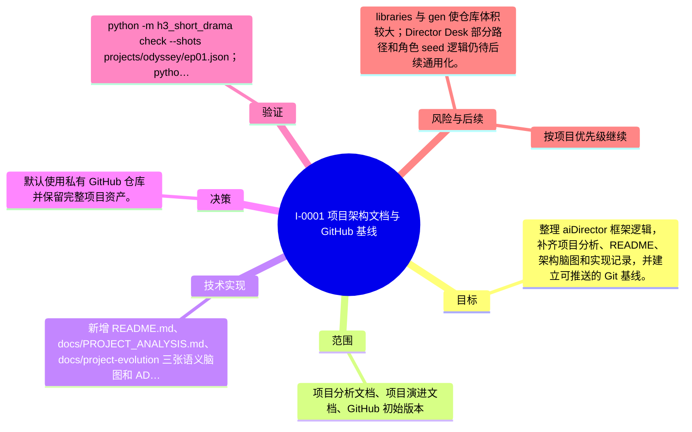

# I-0001 · 项目架构文档与 GitHub 基线

## 结果摘要

整理 aiDirector 框架逻辑，补齐项目分析、README、架构脑图和实现记录，并建立可推送的 Git 基线。

## 迭代脑图

## 目标与范围

### 范围

- 项目分析文档、项目演进文档、GitHub 初始版本

### 非目标

- 未声明

## 变更文件与职责

| 文件 | 本迭代职责/关键符号 |
|---|---|
| `未捕获到 Git 文件变更；请人工补充` | 待补充职责与具体符号 |

## 技术实现

- 新增 README.md、docs/PROJECT_ANALYSIS.md、docs/project-evolution 三张语义脑图和 ADR；使用 .gitignore 排除缓存、环境变量、私钥和本地噪声。

补充时至少覆盖：入口、关键符号、控制流/数据流、接口或 schema、状态与错误、配置、兼容性、测试缝。

## 决策

- 默认使用私有 GitHub 仓库并保留完整项目资产。

如存在长期影响且有真实替代方案，请创建并链接 ADR。

## 验证证据

- python -m h3_short_drama check --shots projects/odyssey/ep01.json；python -m h3_short_drama plan --vram 8 --aspect 9:16 --seconds 5 --quality fast；python -m h3_short_drama prompts --shots projects/odyssey/ep01.json；ffprobe 核验已有成片规格。

## 风险与技术债

- libraries 与 gen 使仓库体积较大；Director Desk 部分路径和角色 seed 逻辑仍待后续通用化。

## 下一步

- 按项目优先级继续

## 追溯信息

- 记录时间：`2026-08-28T14:50:57+08:00`
- Git 分支：`(no git)`
- Git 提交：`(no git commit)`
- 文档生成器：`project_docs.py 1.0.0`
