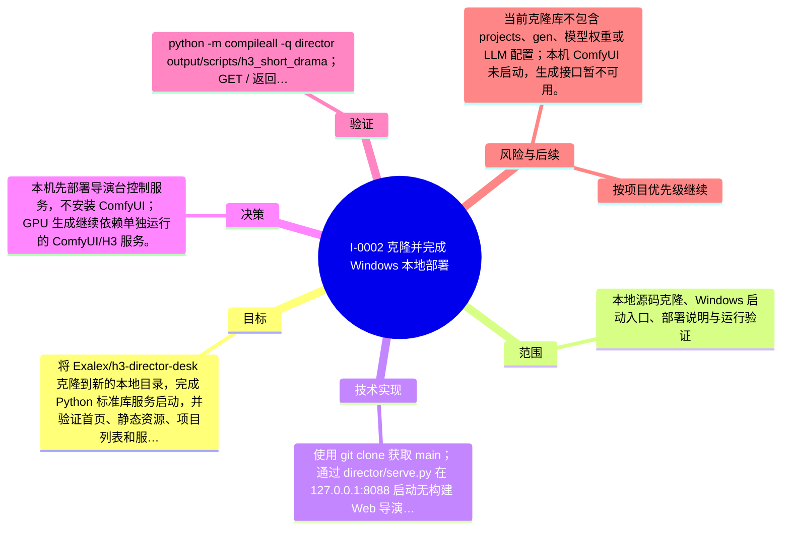

# I-0002 · 克隆并完成 Windows 本地部署

## 结果摘要

将 Exalex/h3-director-desk 克隆到新的本地目录，完成 Python 标准库服务启动，并验证首页、静态资源、项目列表和服务状态接口。

## 迭代脑图

## 目标与范围

### 范围

- 本地源码克隆、Windows 启动入口、部署说明与运行验证

### 非目标

- 未声明

## 变更文件与职责

| 文件 | 本迭代职责/关键符号 |
|---|---|
| `README.md` | 待补充职责与具体符号 |
| `start_local.bat` | 待补充职责与具体符号 |

## 技术实现

- 使用 git clone 获取 main；通过 director/serve.py 在 127.0.0.1:8088 启动无构建 Web 导演台；新增 start_local.bat 和 Windows 本地验证说明。

补充时至少覆盖：入口、关键符号、控制流/数据流、接口或 schema、状态与错误、配置、兼容性、测试缝。

## 决策

- 本机先部署导演台控制服务，不安装 ComfyUI；GPU 生成继续依赖单独运行的 ComfyUI/H3 服务。

如存在长期影响且有真实替代方案，请创建并链接 ADR。

## 验证证据

- python -m compileall -q director output/scripts/h3_short_drama；GET / 返回 200；GET /api/projects 返回 200；GET /api/director 返回 200；GET /assets/app.js 返回 200。ComfyUI 127.0.0.1:8188 当前离线，但页面服务正常。

## 风险与技术债

- 当前克隆库不包含 projects、gen、模型权重或 LLM 配置；本机 ComfyUI 未启动，生成接口暂不可用。

## 下一步

- 按项目优先级继续

## 追溯信息

- 记录时间：`2026-08-31T02:46:17+08:00`
- Git 分支：`main`
- Git 提交：`c54e08ed123f82cd185d410f02c036ac3dbd8678`
- 文档生成器：`project_docs.py 1.0.0`
