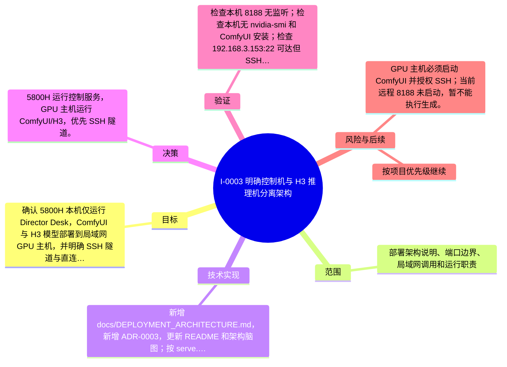

# I-0003 · 明确控制机与 H3 推理机分离架构

## 结果摘要

确认 5800H 本机仅运行 Director Desk，ComfyUI 与 H3 模型部署到局域网 GPU 主机，并明确 SSH 隧道与直连两种方式。

## 迭代脑图

## 目标与范围

### 范围

- 部署架构说明、端口边界、局域网调用和运行职责

### 非目标

- 未声明

## 变更文件与职责

| 文件 | 本迭代职责/关键符号 |
|---|---|
| `README.md` | 待补充职责与具体符号 |
| `docs/DEPLOYMENT_ARCHITECTURE.md` | 待补充职责与具体符号 |

## 技术实现

- 新增 docs/DEPLOYMENT_ARCHITECTURE.md，新增 ADR-0003，更新 README 和架构脑图；按 serve.py --comfy 参数确认远程 ComfyUI 可通过隧道或 LAN HTTP 调用。

补充时至少覆盖：入口、关键符号、控制流/数据流、接口或 schema、状态与错误、配置、兼容性、测试缝。

## 决策

- 5800H 运行控制服务，GPU 主机运行 ComfyUI/H3，优先 SSH 隧道。

如存在长期影响且有真实替代方案，请创建并链接 ADR。

## 验证证据

- 检查本机 8188 无监听；检查本机无 nvidia-smi 和 ComfyUI 安装；检查 192.168.3.153:22 可达但 SSH 认证未通过；检查 192.168.3.153:8188 未监听；project_docs.py validate 通过。

## 风险与技术债

- GPU 主机必须启动 ComfyUI 并授权 SSH；当前远程 8188 未启动，暂不能执行生成。

## 下一步

- 按项目优先级继续

## 追溯信息

- 记录时间：`2026-08-31T11:58:28+08:00`
- Git 分支：`main`
- Git 提交：`091c5bceaeb26e7df06bc7c4517186965e8444c1`
- 文档生成器：`project_docs.py 1.0.0`
