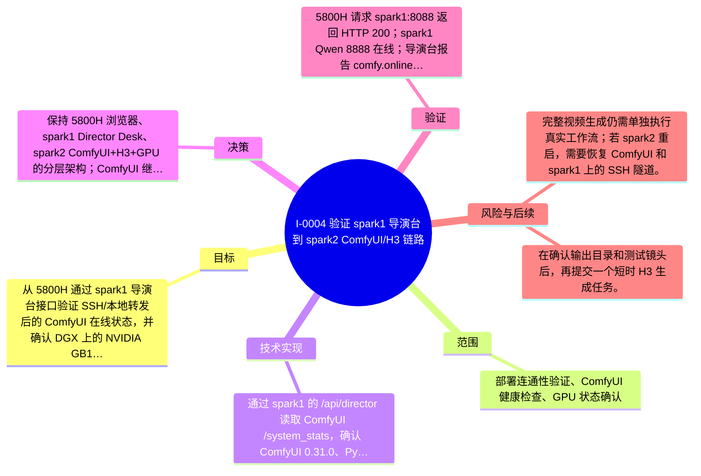

# I-0004 · 验证 spark1 导演台到 spark2 ComfyUI/H3 链路

## 结果摘要

从 5800H 通过 spark1 导演台接口验证 SSH/本地转发后的 ComfyUI 在线状态，并确认 DGX 上的 NVIDIA GB10 GPU 已被 ComfyUI 识别。

## 迭代脑图

## 目标与范围

### 范围

- 部署连通性验证、ComfyUI 健康检查、GPU 状态确认

### 非目标

- 未提交实际 H3 视频生成任务，未验证完整视频产出。

## 变更文件与职责

| 文件 | 本迭代职责/关键符号 |
|---|---|
| `docs/DEPLOYMENT_ARCHITECTURE.md` | 待补充职责与具体符号 |

## 技术实现

- 通过 spark1 的 /api/director 读取 ComfyUI /system_stats，确认 ComfyUI 0.31.0、PyTorch 2.11.0+cu130 和 cuda:0 NVIDIA GB10。

补充时至少覆盖：入口、关键符号、控制流/数据流、接口或 schema、状态与错误、配置、兼容性、测试缝。

## 决策

- 保持 5800H 浏览器、spark1 Director Desk、spark2 ComfyUI+H3+GPU 的分层架构；ComfyUI 继续只监听 spark1 可达的本地转发端口。

如存在长期影响且有真实替代方案，请创建并链接 ADR。

## 验证证据

- 5800H 请求 spark1:8088 返回 HTTP 200；spark1 Qwen 8888 在线；导演台报告 comfy.online=true；ComfyUI system_stats 返回 GPU 与显存信息；未提交生成任务。

## 风险与技术债

- 完整视频生成仍需单独执行真实工作流；若 spark2 重启，需要恢复 ComfyUI 和 spark1 上的 SSH 隧道。

## 下一步

- 在确认输出目录和测试镜头后，再提交一个短时 H3 生成任务。

## 追溯信息

- 记录时间：`2026-08-31T15:39:15+08:00`
- Git 分支：`main`
- Git 提交：`f05a8372114d80f075907caa80775e7150618102`
- 文档生成器：`project_docs.py 1.0.0`
