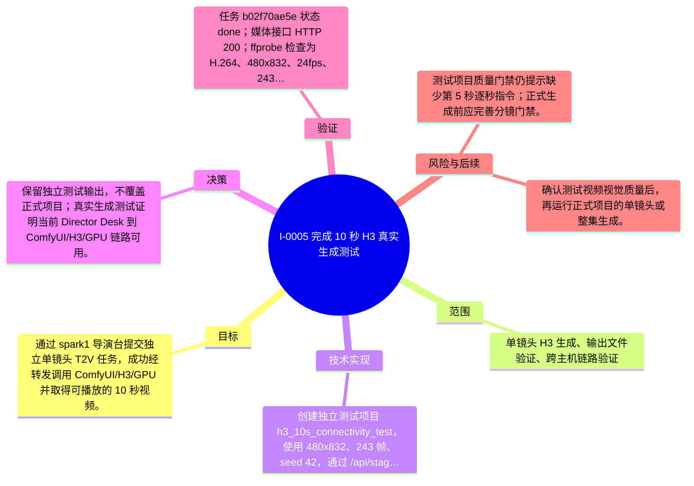

# I-0005 · 完成 10 秒 H3 真实生成测试

## 结果摘要

通过 spark1 导演台提交独立单镜头 T2V 任务，成功经转发调用 ComfyUI/H3/GPU 并取得可播放的 10 秒视频。

## 迭代脑图

## 目标与范围

### 范围

- 单镜头 H3 生成、输出文件验证、跨主机链路验证

### 非目标

- 未运行正式项目整集生成，未改变生产配置。

## 变更文件与职责

| 文件 | 本迭代职责/关键符号 |
|---|---|
| `docs/DEPLOYMENT_ARCHITECTURE.md` | 待补充职责与具体符号 |

## 技术实现

- 创建独立测试项目 h3_10s_connectivity_test，使用 480x832、243 帧、seed 42，通过 /api/stage/generate 提交任务。

补充时至少覆盖：入口、关键符号、控制流/数据流、接口或 schema、状态与错误、配置、兼容性、测试缝。

## 决策

- 保留独立测试输出，不覆盖正式项目；真实生成测试证明当前 Director Desk 到 ComfyUI/H3/GPU 链路可用。

如存在长期影响且有真实替代方案，请创建并链接 ADR。

## 验证证据

- 任务 b02f70ae5e 状态 done；媒体接口 HTTP 200；ffprobe 检查为 H.264、480x832、24fps、243 帧、10.125 秒、约 1.0MB。

## 风险与技术债

- 测试项目质量门禁仍提示缺少第 5 秒逐秒指令；正式生成前应完善分镜门禁。

## 下一步

- 确认测试视频视觉质量后，再运行正式项目的单镜头或整集生成。

## 追溯信息

- 记录时间：`2026-08-31T16:37:56+08:00`
- Git 分支：`main`
- Git 提交：`edfa13cbc71ba66c99a0aa527be5dcb1f60c8ef3`
- 文档生成器：`project_docs.py 1.0.0`
