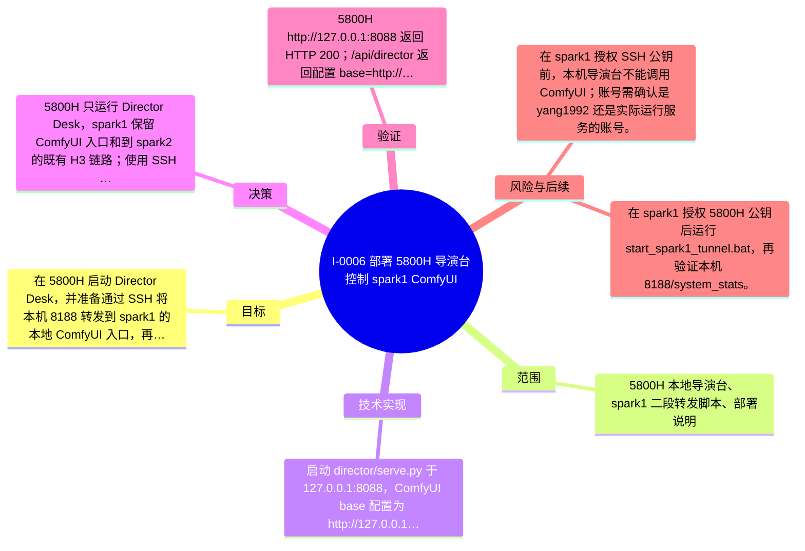

# I-0006 · 部署 5800H 导演台控制 spark1 ComfyUI

## 结果摘要

在 5800H 启动 Director Desk，并准备通过 SSH 将本机 8188 转发到 spark1 的本地 ComfyUI 入口，再复用 spark1 到 spark2 的 H3 链路。

## 迭代脑图

## 目标与范围

### 范围

- 5800H 本地导演台、spark1 二段转发脚本、部署说明

### 非目标

- 未修改 spark1 或 spark2 远程服务，未建立成功 SSH 隧道。

## 变更文件与职责

| 文件 | 本迭代职责/关键符号 |
|---|---|
| `start_spark1_tunnel.bat` | 待补充职责与具体符号 |
| `docs/LOCAL_DEPLOYMENT.md` | 待补充职责与具体符号 |

## 技术实现

- 启动 director/serve.py 于 127.0.0.1:8088，ComfyUI base 配置为 http://127.0.0.1:8188；新增 start_spark1_tunnel.bat 和两段式转发说明。

补充时至少覆盖：入口、关键符号、控制流/数据流、接口或 schema、状态与错误、配置、兼容性、测试缝。

## 决策

- 5800H 只运行 Director Desk，spark1 保留 ComfyUI 入口和到 spark2 的既有 H3 链路；使用 SSH 转发而不是在 5800H 安装 H3。

如存在长期影响且有真实替代方案，请创建并链接 ADR。

## 验证证据

- 5800H http://127.0.0.1:8088 返回 HTTP 200；/api/director 返回配置 base=http://127.0.0.1:8188，但 comfy.online=false；yang1992@192.168.3.75 SSH 公钥认证仍被拒绝。

## 风险与技术债

- 在 spark1 授权 SSH 公钥前，本机导演台不能调用 ComfyUI；账号需确认是 yang1992 还是实际运行服务的账号。

## 下一步

- 在 spark1 授权 5800H 公钥后运行 start_spark1_tunnel.bat，再验证本机 8188/system_stats。

## 追溯信息

- 记录时间：`2026-08-31T17:34:28+08:00`
- Git 分支：`main`
- Git 提交：`910f65d48e0f6ccc3d945d7769f1475682b0fadc`
- 文档生成器：`project_docs.py 1.0.0`
