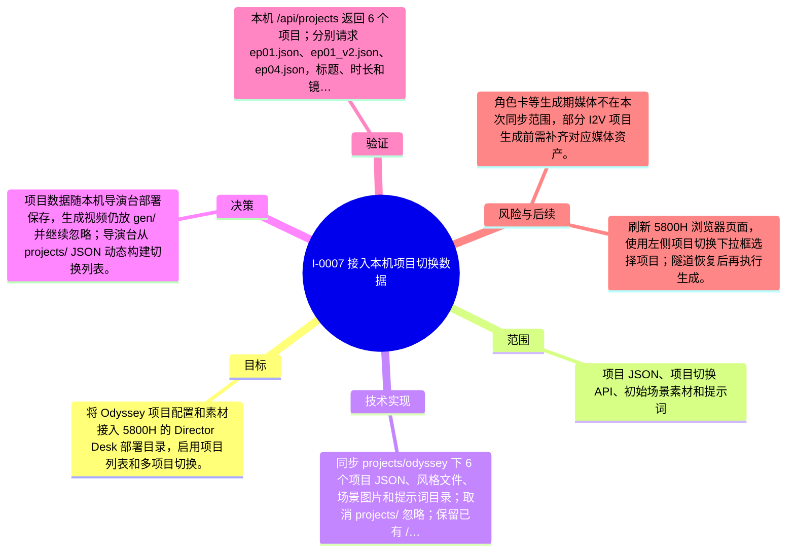

# I-0007 · 接入本机项目切换数据

## 结果摘要

将 Odyssey 项目配置和素材接入 5800H 的 Director Desk 部署目录，启用项目列表和多项目切换。

## 迭代脑图

## 目标与范围

### 范围

- 项目 JSON、项目切换 API、初始场景素材和提示词

### 非目标

- 不复制生成视频、模型权重或远程 spark1/spark2 数据。

## 变更文件与职责

| 文件 | 本迭代职责/关键符号 |
|---|---|
| `README.md` | 待补充职责与具体符号 |
| `docs/LOCAL_DEPLOYMENT.md` | 待补充职责与具体符号 |
| `.gitignore` | 待补充职责与具体符号 |
| `projects/odyssey/STYLE_BIBLE.md` | 待补充职责与具体符号 |
| `projects/odyssey/_prompts_ep01/S01.txt` | 待补充职责与具体符号 |
| `projects/odyssey/_prompts_ep01/S02.txt` | 待补充职责与具体符号 |
| `projects/odyssey/_prompts_ep01/S03.txt` | 待补充职责与具体符号 |
| `projects/odyssey/_prompts_ep01/S04.txt` | 待补充职责与具体符号 |
| `projects/odyssey/_prompts_ep01_v2/S01.txt` | 待补充职责与具体符号 |
| `projects/odyssey/_prompts_ep01_v2/S02.txt` | 待补充职责与具体符号 |
| `projects/odyssey/_prompts_ep01_v2/S03.txt` | 待补充职责与具体符号 |
| `projects/odyssey/_prompts_ep01_v2/S04.txt` | 待补充职责与具体符号 |
| `projects/odyssey/_prompts_ep01_v2/S05.txt` | 待补充职责与具体符号 |
| `projects/odyssey/_prompts_ep01_v2/S06.txt` | 待补充职责与具体符号 |
| `projects/odyssey/_prompts_ep04/S01.txt` | 待补充职责与具体符号 |
| `projects/odyssey/_prompts_ep04/S02.txt` | 待补充职责与具体符号 |
| `projects/odyssey/_prompts_ep04/S03.txt` | 待补充职责与具体符号 |
| `projects/odyssey/_prompts_ep04/S04.txt` | 待补充职责与具体符号 |
| `projects/odyssey/_prompts_ep04/S05.txt` | 待补充职责与具体符号 |
| `projects/odyssey/_prompts_ep04/S06.txt` | 待补充职责与具体符号 |
| `projects/odyssey/assets/megaron.png` | 待补充职责与具体符号 |
| `projects/odyssey/assets/megaron_v2.png` | 待补充职责与具体符号 |
| `projects/odyssey/cards.json` | 待补充职责与具体符号 |
| `projects/odyssey/cards_ep04.json` | 待补充职责与具体符号 |
| `projects/odyssey/cards_v2.json` | 待补充职责与具体符号 |
| `projects/odyssey/ep01.json` | 待补充职责与具体符号 |
| `projects/odyssey/ep01_v2.json` | 待补充职责与具体符号 |
| `projects/odyssey/ep04.json` | 待补充职责与具体符号 |

## 技术实现

- 同步 projects/odyssey 下 6 个项目 JSON、风格文件、场景图片和提示词目录；取消 projects/ 忽略；保留已有 /api/projects 和 /api/project 切换逻辑。

补充时至少覆盖：入口、关键符号、控制流/数据流、接口或 schema、状态与错误、配置、兼容性、测试缝。

## 决策

- 项目数据随本机导演台部署保存，生成视频仍放 gen/ 并继续忽略；导演台从 projects/ JSON 动态构建切换列表。

如存在长期影响且有真实替代方案，请创建并链接 ADR。

## 验证证据

- 本机 /api/projects 返回 6 个项目；分别请求 ep01.json、ep01_v2.json、ep04.json，标题、时长和镜头数均与目标项目一致。

## 风险与技术债

- 角色卡等生成期媒体不在本次同步范围，部分 I2V 项目生成前需补齐对应媒体资产。

## 下一步

- 刷新 5800H 浏览器页面，使用左侧项目切换下拉框选择项目；隧道恢复后再执行生成。

## 追溯信息

- 记录时间：`2026-08-31T17:40:55+08:00`
- Git 分支：`main`
- Git 提交：`5571b2629d5f67ea4e8cabe1d5cda981c8b7f98c`
- 文档生成器：`project_docs.py 1.0.0`
