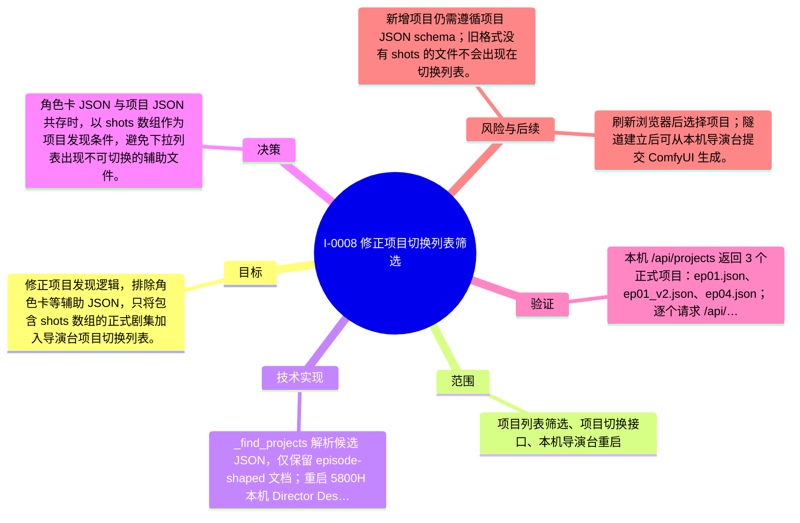

# I-0008 · 修正项目切换列表筛选

## 结果摘要

修正项目发现逻辑，排除角色卡等辅助 JSON，只将包含 shots 数组的正式剧集加入导演台项目切换列表。

## 迭代脑图

## 目标与范围

### 范围

- 项目列表筛选、项目切换接口、本机导演台重启

### 非目标

- 不改变项目内容和生成逻辑。

## 变更文件与职责

| 文件 | 本迭代职责/关键符号 |
|---|---|
| `director/serve.py` | 待补充职责与具体符号 |
| `projects/odyssey` | 待补充职责与具体符号 |

## 技术实现

- _find_projects 解析候选 JSON，仅保留 episode-shaped 文档；重启 5800H 本机 Director Desk。

补充时至少覆盖：入口、关键符号、控制流/数据流、接口或 schema、状态与错误、配置、兼容性、测试缝。

## 决策

- 角色卡 JSON 与项目 JSON 共存时，以 shots 数组作为项目发现条件，避免下拉列表出现不可切换的辅助文件。

如存在长期影响且有真实替代方案，请创建并链接 ADR。

## 验证证据

- 本机 /api/projects 返回 3 个正式项目：ep01.json、ep01_v2.json、ep04.json；逐个请求 /api/project 返回对应标题和 4/6/6 个镜头；首页 HTTP 200。

## 风险与技术债

- 新增项目仍需遵循项目 JSON schema；旧格式没有 shots 的文件不会出现在切换列表。

## 下一步

- 刷新浏览器后选择项目；隧道建立后可从本机导演台提交 ComfyUI 生成。

## 追溯信息

- 记录时间：`2026-08-31T17:43:24+08:00`
- Git 分支：`main`
- Git 提交：`825f8d6c3c4daa1ef55d301612697a932ec674cf`
- 文档生成器：`project_docs.py 1.0.0`
