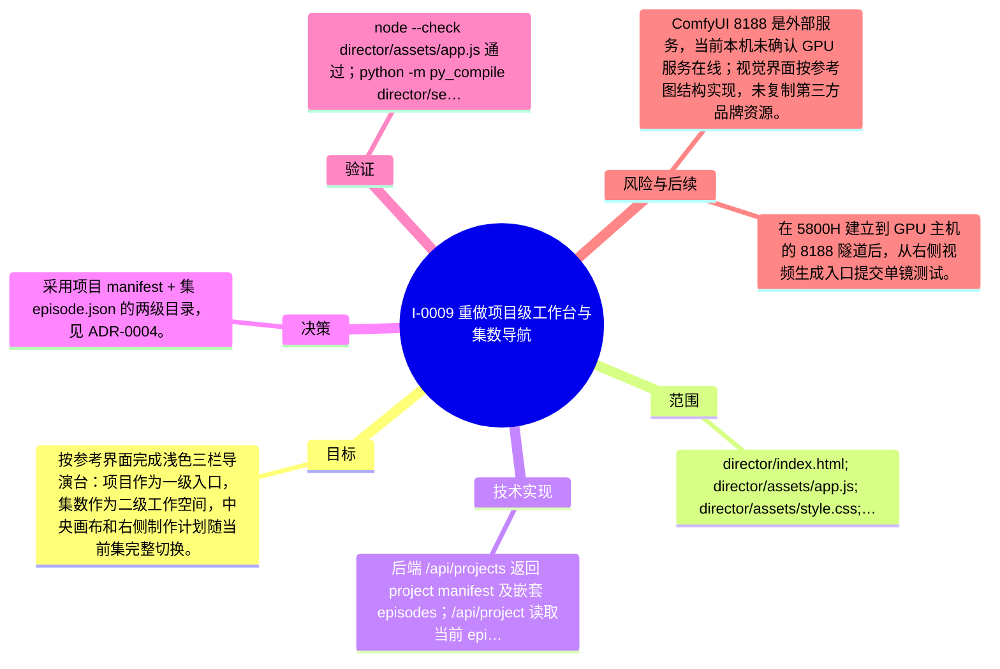

# I-0009 · 重做项目级工作台与集数导航

## 结果摘要

按参考界面完成浅色三栏导演台：项目作为一级入口，集数作为二级工作空间，中央画布和右侧制作计划随当前集完整切换。

## 迭代脑图

## 目标与范围

### 范围

- director/index.html; director/assets/app.js; director/assets/style.css; director/serve.py; projects/odyssey hierarchy; README and deployment docs

### 非目标

- 不改变 H3 模型、ComfyUI 工作流和生成管线核心逻辑；不在无 GPU 的 5800H 上运行模型。

## 变更文件与职责

| 文件 | 本迭代职责/关键符号 |
|---|---|
| `README.md` | 待补充职责与具体符号 |
| `director/README.md` | 待补充职责与具体符号 |
| `director/assets/app.js` | 待补充职责与具体符号 |
| `director/assets/panels.js` | 待补充职责与具体符号 |
| `director/assets/style.css` | 待补充职责与具体符号 |
| `director/index.html` | 待补充职责与具体符号 |
| `director/serve.py` | 待补充职责与具体符号 |
| `docs/LOCAL_DEPLOYMENT.md` | 待补充职责与具体符号 |
| `projects/odyssey/STYLE_BIBLE.md` | 待补充职责与具体符号 |
| `projects/odyssey/_prompts_ep01/S01.txt` | 待补充职责与具体符号 |
| `projects/odyssey/_prompts_ep01/S02.txt` | 待补充职责与具体符号 |
| `projects/odyssey/_prompts_ep01/S03.txt` | 待补充职责与具体符号 |
| `projects/odyssey/_prompts_ep01/S04.txt` | 待补充职责与具体符号 |
| `projects/odyssey/_prompts_ep01_v2/S01.txt` | 待补充职责与具体符号 |
| `projects/odyssey/_prompts_ep01_v2/S02.txt` | 待补充职责与具体符号 |
| `projects/odyssey/_prompts_ep01_v2/S03.txt` | 待补充职责与具体符号 |
| `projects/odyssey/_prompts_ep01_v2/S04.txt` | 待补充职责与具体符号 |
| `projects/odyssey/_prompts_ep01_v2/S05.txt` | 待补充职责与具体符号 |
| `projects/odyssey/_prompts_ep01_v2/S06.txt` | 待补充职责与具体符号 |
| `projects/odyssey/_prompts_ep04/S01.txt` | 待补充职责与具体符号 |
| `projects/odyssey/_prompts_ep04/S02.txt` | 待补充职责与具体符号 |
| `projects/odyssey/_prompts_ep04/S03.txt` | 待补充职责与具体符号 |
| `projects/odyssey/_prompts_ep04/S04.txt` | 待补充职责与具体符号 |
| `projects/odyssey/_prompts_ep04/S05.txt` | 待补充职责与具体符号 |
| `projects/odyssey/_prompts_ep04/S06.txt` | 待补充职责与具体符号 |
| `projects/odyssey/assets/megaron.png` | 待补充职责与具体符号 |
| `projects/odyssey/assets/megaron_v2.png` | 待补充职责与具体符号 |
| `projects/odyssey/cards.json` | 待补充职责与具体符号 |
| `projects/odyssey/cards_ep04.json` | 待补充职责与具体符号 |
| `projects/odyssey/cards_v2.json` | 待补充职责与具体符号 |
| `projects/odyssey/ep01.json` | 待补充职责与具体符号 |
| `projects/odyssey/ep01_v2.json` | 待补充职责与具体符号 |
| `projects/odyssey/ep04.json` | 待补充职责与具体符号 |
| `projects/README.md` | 待补充职责与具体符号 |
| `projects/odyssey/assets/README.md` | 待补充职责与具体符号 |
| `projects/odyssey/episodes/ep01/STYLE_BIBLE.md` | 待补充职责与具体符号 |
| `projects/odyssey/episodes/ep01/assets/megaron.png` | 待补充职责与具体符号 |
| `projects/odyssey/episodes/ep01/episode.json` | 待补充职责与具体符号 |
| `projects/odyssey/episodes/ep01/outputs/.gitignore` | 待补充职责与具体符号 |
| `projects/odyssey/episodes/ep01/prompts/S01.txt` | 待补充职责与具体符号 |
| `projects/odyssey/episodes/ep01/prompts/S02.txt` | 待补充职责与具体符号 |
| `projects/odyssey/episodes/ep01/prompts/S03.txt` | 待补充职责与具体符号 |
| `projects/odyssey/episodes/ep01/prompts/S04.txt` | 待补充职责与具体符号 |
| `projects/odyssey/episodes/ep01/references/card_Antinous.png` | 待补充职责与具体符号 |
| `projects/odyssey/episodes/ep01/references/card_Penelope.png` | 待补充职责与具体符号 |
| `projects/odyssey/episodes/ep01/references/card_Telemachus.png` | 待补充职责与具体符号 |
| `projects/odyssey/episodes/ep01_v2/STYLE_BIBLE.md` | 待补充职责与具体符号 |
| `projects/odyssey/episodes/ep01_v2/assets/megaron_v2.png` | 待补充职责与具体符号 |
| `projects/odyssey/episodes/ep01_v2/episode.json` | 待补充职责与具体符号 |
| `projects/odyssey/episodes/ep01_v2/outputs/.gitignore` | 待补充职责与具体符号 |
| `projects/odyssey/episodes/ep01_v2/prompts/S01.txt` | 待补充职责与具体符号 |
| `projects/odyssey/episodes/ep01_v2/prompts/S02.txt` | 待补充职责与具体符号 |
| `projects/odyssey/episodes/ep01_v2/prompts/S03.txt` | 待补充职责与具体符号 |
| `projects/odyssey/episodes/ep01_v2/prompts/S04.txt` | 待补充职责与具体符号 |
| `projects/odyssey/episodes/ep01_v2/prompts/S05.txt` | 待补充职责与具体符号 |
| `projects/odyssey/episodes/ep01_v2/prompts/S06.txt` | 待补充职责与具体符号 |
| `projects/odyssey/episodes/ep01_v2/references/card_Antinous.png` | 待补充职责与具体符号 |
| `projects/odyssey/episodes/ep01_v2/references/card_Penelope.png` | 待补充职责与具体符号 |
| `projects/odyssey/episodes/ep01_v2/references/card_Telemachus.png` | 待补充职责与具体符号 |
| `projects/odyssey/episodes/ep04/STYLE_BIBLE.md` | 待补充职责与具体符号 |
| `projects/odyssey/episodes/ep04/assets/README.md` | 待补充职责与具体符号 |
| `projects/odyssey/episodes/ep04/episode.json` | 待补充职责与具体符号 |
| `projects/odyssey/episodes/ep04/outputs/.gitignore` | 待补充职责与具体符号 |
| `projects/odyssey/episodes/ep04/prompts/S01.txt` | 待补充职责与具体符号 |
| `projects/odyssey/episodes/ep04/prompts/S02.txt` | 待补充职责与具体符号 |
| `projects/odyssey/episodes/ep04/prompts/S03.txt` | 待补充职责与具体符号 |
| `projects/odyssey/episodes/ep04/prompts/S04.txt` | 待补充职责与具体符号 |
| `projects/odyssey/episodes/ep04/prompts/S05.txt` | 待补充职责与具体符号 |
| `projects/odyssey/episodes/ep04/prompts/S06.txt` | 待补充职责与具体符号 |
| `projects/odyssey/episodes/ep04/references/card_Calypso.png` | 待补充职责与具体符号 |
| `projects/odyssey/episodes/ep04/references/card_Hermes.png` | 待补充职责与具体符号 |
| `projects/odyssey/episodes/ep04/references/card_Odysseus.png` | 待补充职责与具体符号 |
| `projects/odyssey/project.json` | 待补充职责与具体符号 |

## 技术实现

- 后端 /api/projects 返回 project manifest 及嵌套 episodes；/api/project 读取当前 episode.json；前端 selectProject/selectEpisode 清理旧状态后重载当前集，renderCanvas/renderPlan/renderConversation 绑定当前集；生成仍通过 /api/stage/generate 后台任务调用 ComfyUI。

补充时至少覆盖：入口、关键符号、控制流/数据流、接口或 schema、状态与错误、配置、兼容性、测试缝。

## 决策

- 采用项目 manifest + 集 episode.json 的两级目录，见 ADR-0004。

如存在长期影响且有真实替代方案，请创建并链接 ADR。

## 验证证据

- node --check director/assets/app.js 通过；python -m py_compile director/serve.py 通过；git diff --check 通过；三集 h3_short_drama check 均 PASS；首页 HTTP 200；/api/projects 返回奥德赛及 3 集；浏览器已从 ep01 切换到 ep01_v2 和 ep04，标题、时长、镜头数与资产随集更新；视频生成入口弹窗可打开。

## 风险与技术债

- ComfyUI 8188 是外部服务，当前本机未确认 GPU 服务在线；视觉界面按参考图结构实现，未复制第三方品牌资源。

## 下一步

- 在 5800H 建立到 GPU 主机的 8188 隧道后，从右侧视频生成入口提交单镜测试。

## 追溯信息

- 记录时间：`2026-08-31T20:00:13+08:00`
- Git 分支：`main`
- Git 提交：`27b0c6a1b5d05ff9f4846c6b950b96a6b178bd03`
- 文档生成器：`project_docs.py 1.0.0`
