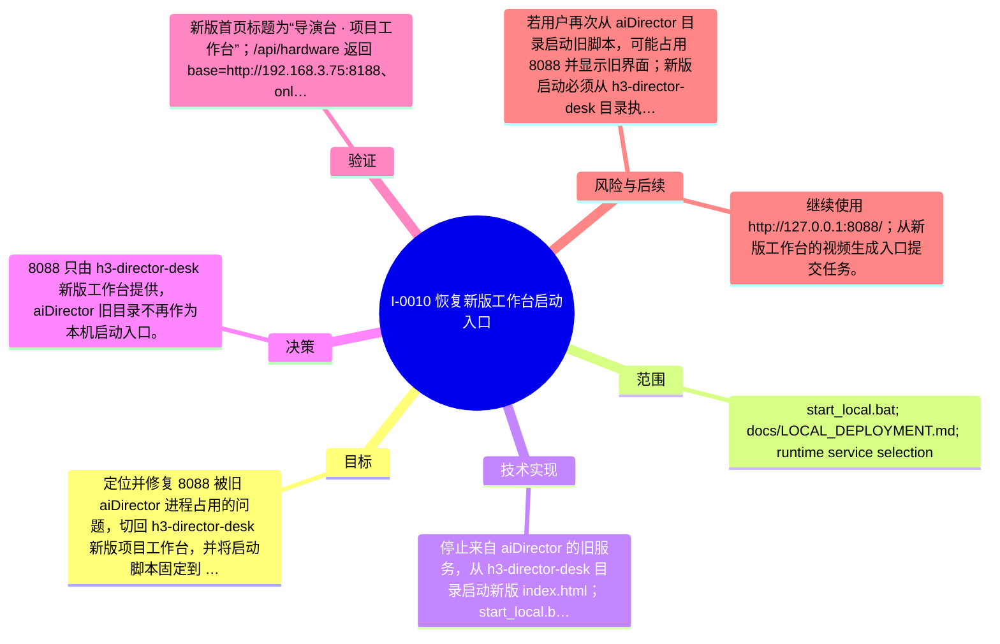

# I-0010 · 恢复新版工作台启动入口

## 结果摘要

定位并修复 8088 被旧 aiDirector 进程占用的问题，切回 h3-director-desk 新版项目工作台，并将启动脚本固定到 spark1 ComfyUI 地址。

## 迭代脑图

## 目标与范围

### 范围

- start_local.bat; docs/LOCAL_DEPLOYMENT.md; runtime service selection

### 非目标

- 不修改 H3 生成管线，不在旧 aiDirector 目录继续启动 8088。

## 变更文件与职责

| 文件 | 本迭代职责/关键符号 |
|---|---|
| `docs/LOCAL_DEPLOYMENT.md` | 待补充职责与具体符号 |
| `start_local.bat` | 待补充职责与具体符号 |

## 技术实现

- 停止来自 aiDirector 的旧服务，从 h3-director-desk 目录启动新版 index.html；start_local.bat 使用 192.168.3.75:8188；部署文档按 spark1 LAN 转发拓扑更新。

补充时至少覆盖：入口、关键符号、控制流/数据流、接口或 schema、状态与错误、配置、兼容性、测试缝。

## 决策

- 8088 只由 h3-director-desk 新版工作台提供，aiDirector 旧目录不再作为本机启动入口。

如存在长期影响且有真实替代方案，请创建并链接 ADR。

## 验证证据

- 新版首页标题为“导演台 · 项目工作台”；/api/hardware 返回 base=http://192.168.3.75:8188、online=true；ComfyUI 0.31.0、NVIDIA GB10；首页 HTTP 200；node --check、py_compile、git diff --check 通过。

## 风险与技术债

- 若用户再次从 aiDirector 目录启动旧脚本，可能占用 8088 并显示旧界面；新版启动必须从 h3-director-desk 目录执行。

## 下一步

- 继续使用 http://127.0.0.1:8088/；从新版工作台的视频生成入口提交任务。

## 追溯信息

- 记录时间：`2026-09-01T00:46:37+08:00`
- Git 分支：`main`
- Git 提交：`e26bffddf5547294a294a578ed60b17becca549e`
- 文档生成器：`project_docs.py 1.0.0`
