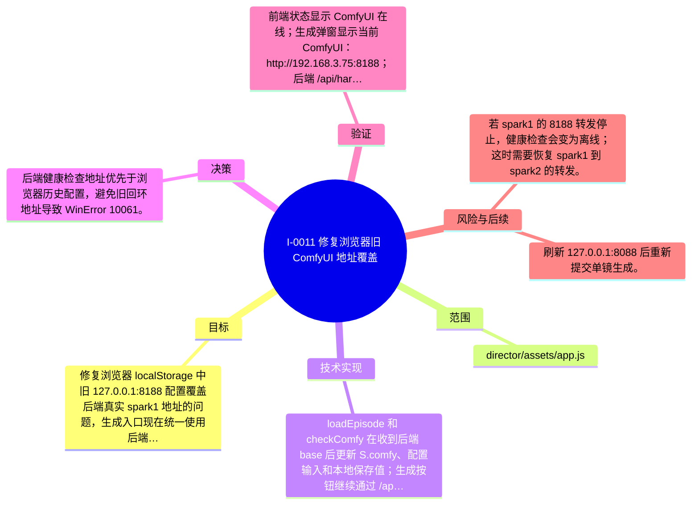

# I-0011 · 修复浏览器旧 ComfyUI 地址覆盖

## 结果摘要

修复浏览器 localStorage 中旧 127.0.0.1:8188 配置覆盖后端真实 spark1 地址的问题，生成入口现在统一使用后端健康检查返回的 192.168.3.75:8188。

## 迭代脑图

## 目标与范围

### 范围

- director/assets/app.js

### 非目标

- 不修改 ComfyUI/H3 服务，不重复提交 GPU 生成任务。

## 变更文件与职责

| 文件 | 本迭代职责/关键符号 |
|---|---|
| `director/assets/app.js` | 待补充职责与具体符号 |

## 技术实现

- loadEpisode 和 checkComfy 在收到后端 base 后更新 S.comfy、配置输入和本地保存值；生成按钮继续通过 /api/stage/generate 发送当前地址。

补充时至少覆盖：入口、关键符号、控制流/数据流、接口或 schema、状态与错误、配置、兼容性、测试缝。

## 决策

- 后端健康检查地址优先于浏览器历史配置，避免旧回环地址导致 WinError 10061。

如存在长期影响且有真实替代方案，请创建并链接 ADR。

## 验证证据

- 前端状态显示 ComfyUI 在线；生成弹窗显示当前 ComfyUI：http://192.168.3.75:8188；后端 /api/hardware online=true；node --check、py_compile、git diff --check 通过。

## 风险与技术债

- 若 spark1 的 8188 转发停止，健康检查会变为离线；这时需要恢复 spark1 到 spark2 的转发。

## 下一步

- 刷新 127.0.0.1:8088 后重新提交单镜生成。

## 追溯信息

- 记录时间：`2026-09-01T00:52:35+08:00`
- Git 分支：`main`
- Git 提交：`d25156b1bb28c90b5bf2fb649c9387c9e94aabbb`
- 文档生成器：`project_docs.py 1.0.0`
