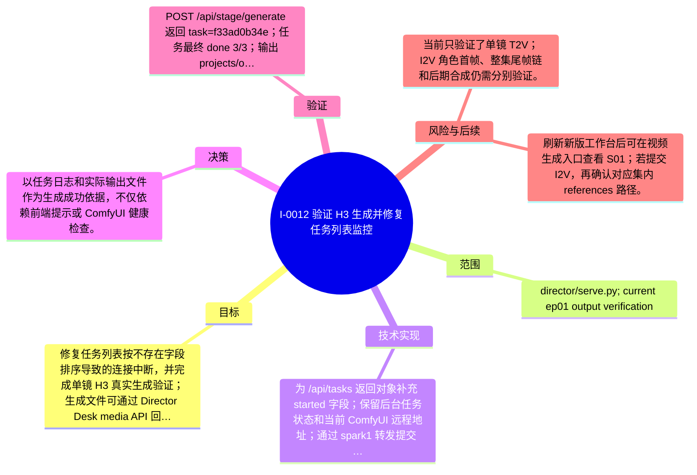

# I-0012 · 验证 H3 生成并修复任务列表监控

## 结果摘要

修复任务列表按不存在字段排序导致的连接中断，并完成单镜 H3 真实生成验证；生成文件可通过 Director Desk media API 回显。

## 迭代脑图

## 目标与范围

### 范围

- director/serve.py; current ep01 output verification

### 非目标

- 不修改 ComfyUI 工作流和模型配置，不执行整集生成。

## 变更文件与职责

| 文件 | 本迭代职责/关键符号 |
|---|---|
| `director/serve.py` | 待补充职责与具体符号 |

## 技术实现

- 为 /api/tasks 返回对象补充 started 字段；保留后台任务状态和当前 ComfyUI 远程地址；通过 spark1 转发提交 ep01/S01 到 ComfyUI/H3。

补充时至少覆盖：入口、关键符号、控制流/数据流、接口或 schema、状态与错误、配置、兼容性、测试缝。

## 决策

- 以任务日志和实际输出文件作为生成成功依据，不仅依赖前端提示或 ComfyUI 健康检查。

如存在长期影响且有真实替代方案，请创建并链接 ADR。

## 验证证据

- POST /api/stage/generate 返回 task=f33ad0b34e；任务最终 done 3/3；输出 projects/odyssey/episodes/ep01/outputs/S01.mp4；ffprobe 显示 h264 480x832 24fps、aac、5.167s；/api/media HEAD 返回 200 video/mp4；/api/tasks 返回 200。

## 风险与技术债

- 当前只验证了单镜 T2V；I2V 角色首帧、整集尾帧链和后期合成仍需分别验证。

## 下一步

- 刷新新版工作台后可在视频生成入口查看 S01；若提交 I2V，再确认对应集内 references 路径。

## 追溯信息

- 记录时间：`2026-09-01T01:02:55+08:00`
- Git 分支：`main`
- Git 提交：`ed23d558bbb8beacac777fa375650b7622dcd7b4`
- 文档生成器：`project_docs.py 1.0.0`
