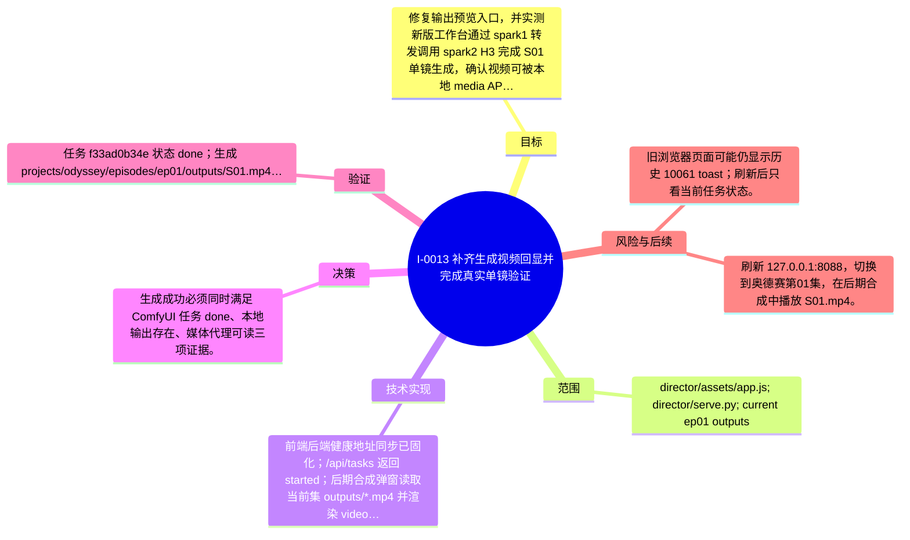

# I-0013 · 补齐生成视频回显并完成真实单镜验证

## 结果摘要

修复输出预览入口，并实测新版工作台通过 spark1 转发调用 spark2 H3 完成 S01 单镜生成，确认视频可被本地 media API 读取。

## 迭代脑图

## 目标与范围

### 范围

- director/assets/app.js; director/serve.py; current ep01 outputs

### 非目标

- 不执行整集生成，不修改 ComfyUI 节点和模型权重。

## 变更文件与职责

| 文件 | 本迭代职责/关键符号 |
|---|---|
| `director/assets/app.js` | 待补充职责与具体符号 |

## 技术实现

- 前端后端健康地址同步已固化；/api/tasks 返回 started；后期合成弹窗读取当前集 outputs/*.mp4 并渲染 video 播放器；使用当前集 episode.json 提交 S01。

补充时至少覆盖：入口、关键符号、控制流/数据流、接口或 schema、状态与错误、配置、兼容性、测试缝。

## 决策

- 生成成功必须同时满足 ComfyUI 任务 done、本地输出存在、媒体代理可读三项证据。

如存在长期影响且有真实替代方案，请创建并链接 ADR。

## 验证证据

- 任务 f33ad0b34e 状态 done；生成 projects/odyssey/episodes/ep01/outputs/S01.mp4；ffprobe 为 h264 480x832 24fps、aac、5.167s；/api/media HEAD 200；新版首页 200；浏览器切换 ep01 后预览入口出现 S01.mp4；文档 validate 通过。

## 风险与技术债

- 旧浏览器页面可能仍显示历史 10061 toast；刷新后只看当前任务状态。

## 下一步

- 刷新 127.0.0.1:8088，切换到奥德赛第01集，在后期合成中播放 S01.mp4。

## 追溯信息

- 记录时间：`2026-09-01T01:06:27+08:00`
- Git 分支：`main`
- Git 提交：`a3b662cb314a4058c4c7f24ad2f07bb0f5167e26`
- 文档生成器：`project_docs.py 1.0.0`
