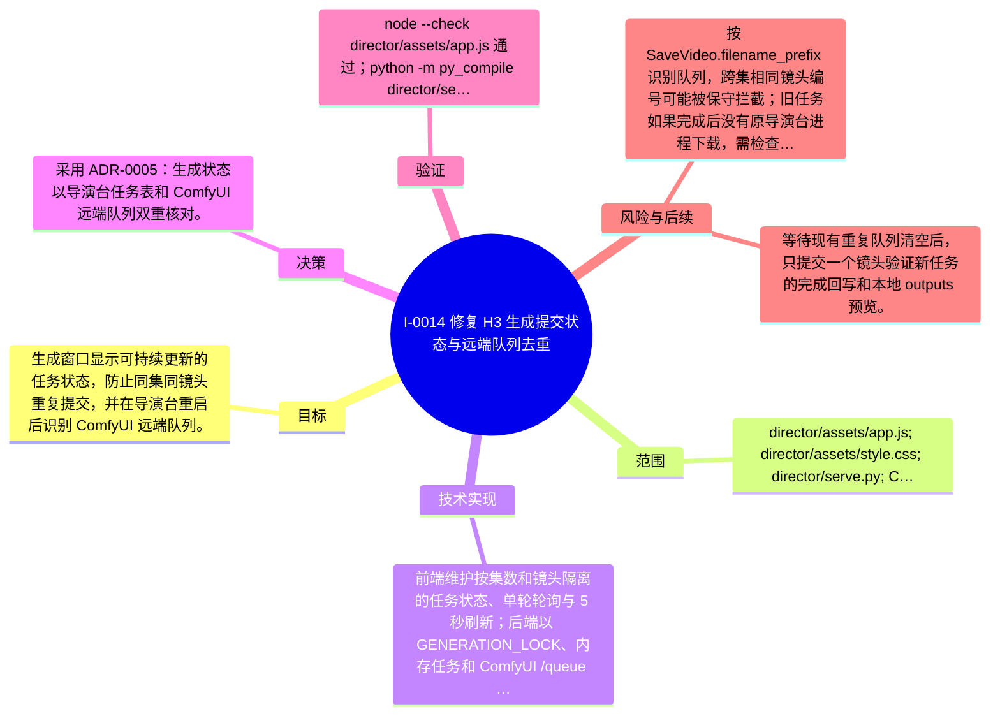

# I-0014 · 修复 H3 生成提交状态与远端队列去重

## 结果摘要

生成窗口显示可持续更新的任务状态，防止同集同镜头重复提交，并在导演台重启后识别 ComfyUI 远端队列。

## 迭代脑图

## 目标与范围

### 范围

- director/assets/app.js; director/assets/style.css; director/serve.py; ComfyUI 远端队列识别

### 非目标

- 不取消已有 ComfyUI 任务，不修改 H3 模型和 ComfyUI 节点工作流。

## 变更文件与职责

| 文件 | 本迭代职责/关键符号 |
|---|---|
| `director/assets/app.js` | `generationTasks`、`generationPolls`、`syncGenerationStatus`、`startGenerationPoll`：按集/镜头回显状态，避免重复轮询和重复点击 |
| `director/assets/style.css` | `.generation-row`、`.generation-status`：为状态文本提供稳定布局和状态色 |
| `director/serve.py` | `GENERATION_LOCK`、`active_generation`、`remote_generations`、`remote_generation`：在内存任务和 ComfyUI `/queue` 之间做生成幂等检查 |

## 技术实现

- `openStage("generate")` 重新渲染镜头行后调用 `syncGenerationStatus`，通过 `/api/files` 识别已有输出，通过 `/api/tasks` 合并导演台任务和远端队列；远端任务按 `SaveVideo.filename_prefix` 映射到镜头，并以 `remote` 标记不启动不存在的本地 task 轮询。
- `generateShot` 在本地状态和服务端返回中都保留运行态；`GENERATION_LOCK` 防止并发 POST 重复创建任务，`remote_generation` 防止导演台重启后再次向 ComfyUI 排队；前端 `generationPolls` 保证同一 task 只有一条轮询链。
- 生成窗口每 5 秒重新同步队列和 `outputs/`，状态依次可见为提交中、ComfyUI 队列中、H3 处理中进度、完成或失败；集数切换时轮询携带 `episodePath`，旧集结果不会写入新集。

补充时至少覆盖：入口、关键符号、控制流/数据流、接口或 schema、状态与错误、配置、兼容性、测试缝。

## 决策

- 采用 ADR-0005：生成状态以导演台任务表和 ComfyUI 远端队列双重核对。

如存在长期影响且有真实替代方案，请创建并链接 ADR。

## 验证证据

- node --check director/assets/app.js 通过；python -m py_compile director/serve.py 通过；git diff --check 通过；/api/hardware 返回 ComfyUI 0.31.0 online=true；/api/tasks 重启后读回 S01/S02/S03 远端任务；重复 POST S02 返回 status=existing、remote=true；浏览器重载后生成窗口显示队列中且按钮 disabled。

## 风险与技术债

- 按 SaveVideo.filename_prefix 识别队列，跨集相同镜头编号可能被保守拦截；旧任务如果完成后没有原导演台进程下载，需检查 ComfyUI 输出或重新生成。

## 下一步

- 等待现有重复队列清空后，只提交一个镜头验证新任务的完成回写和本地 outputs 预览。

## 追溯信息

- 记录时间：`2026-09-01T07:41:30+08:00`
- Git 分支：`main`
- Git 提交：`419ca1dad38735c95e82eb5d6f5f1a4fd0e3f028`
- 文档生成器：`project_docs.py 1.0.0`
