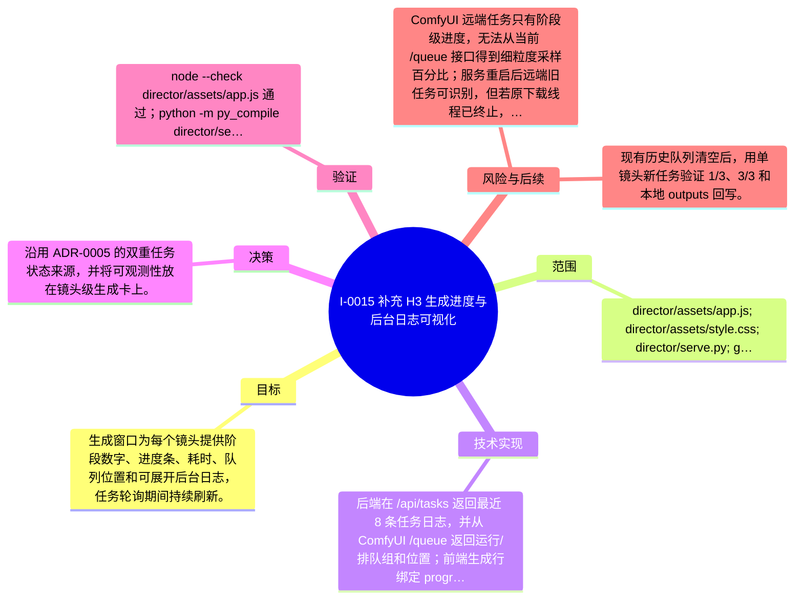

# I-0015 · 补充 H3 生成进度与后台日志可视化

## 结果摘要

生成窗口为每个镜头提供阶段数字、进度条、耗时、队列位置和可展开后台日志，任务轮询期间持续刷新。

## 迭代脑图

## 目标与范围

### 范围

- director/assets/app.js; director/assets/style.css; director/serve.py; generation modal observability

### 非目标

- 不改变 H3 工作流、模型参数或已有远端队列，不取消正在运行的任务。

## 变更文件与职责

| 文件 | 本迭代职责/关键符号 |
|---|---|
| `director/assets/app.js` | `updateGenerationRow`、`syncGenerationStatus`：渲染镜头级阶段、进度、耗时、队列位置和日志 |
| `director/assets/style.css` | `.generation-meter`、`.generation-meta`、`.generation-details`：为进度条、元信息和日志展开区提供布局 |
| `director/serve.py` | `remote_generations`、`/api/tasks`：返回队列组、位置和最近日志，供前端观察任务 |

## 技术实现

- `/api/tasks` 返回最近 8 条任务日志，并从 ComfyUI `/queue` 返回运行/排队组和位置；前端生成行绑定 progress/meta/log 节点，按 `task.cur/total` 渲染阶段进度，并每 5 秒同步远端队列。

补充时至少覆盖：入口、关键符号、控制流/数据流、接口或 schema、状态与错误、配置、兼容性、测试缝。

## 决策

- 沿用 ADR-0005 的双重任务状态来源，并将可观测性放在镜头级生成卡上。

如存在长期影响且有真实替代方案，请创建并链接 ADR。

## 验证证据

- node --check director/assets/app.js 通过；python -m py_compile director/serve.py 通过；git diff --check 通过；浏览器生成窗口显示 4 个进度条和 4 个日志面板；展开 S01 日志显示远端队列位置；/api/hardware 返回 online=true、ComfyUI 0.31.0。

## 风险与技术债

- ComfyUI 远端任务只有阶段级进度，无法从当前 /queue 接口得到细粒度采样百分比；服务重启后远端旧任务可识别，但若原下载线程已终止，完成文件可能仍需手动检查。

## 下一步

- 现有历史队列清空后，用单镜头新任务验证 1/3、3/3 和本地 outputs 回写。

## 追溯信息

- 记录时间：`2026-09-01T08:08:52+08:00`
- Git 分支：`main`
- Git 提交：`da0b1740875faf244c7f6268449e062736d148d4`
- 文档生成器：`project_docs.py 1.0.0`
