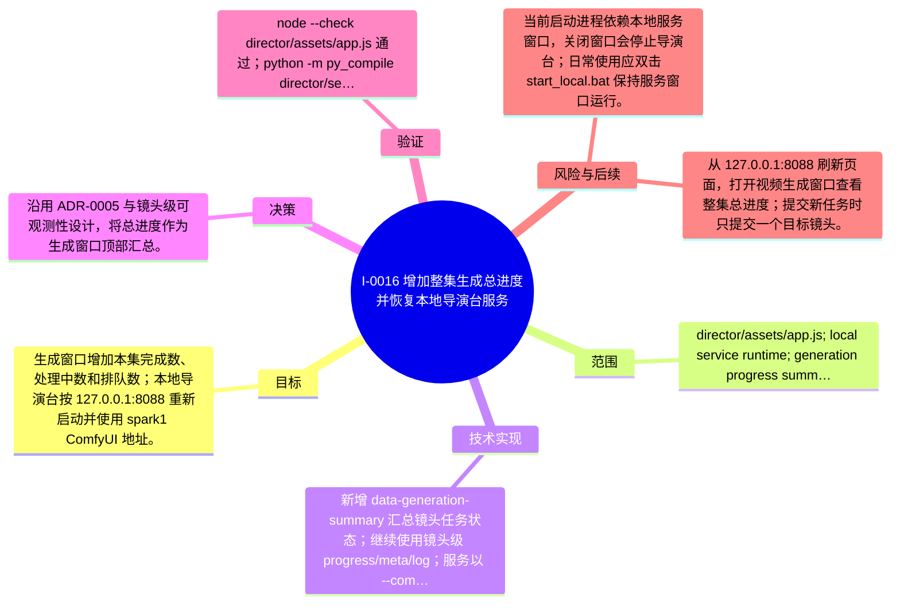

# I-0016 · 增加整集生成总进度并恢复本地导演台服务

## 结果摘要

生成窗口增加本集完成数、处理中数和排队数；本地导演台按 127.0.0.1:8088 重新启动并使用 spark1 ComfyUI 地址。

## 迭代脑图

## 目标与范围

### 范围

- director/assets/app.js; local service runtime; generation progress summary

### 非目标

- 不主动取消或重新提交任何 H3 任务，不改变远端 ComfyUI 工作流。

## 变更文件与职责

| 文件 | 本迭代职责/关键符号 |
|---|---|
| `director/assets/app.js` | `updateGenerationSummary`：汇总当前集已完成、处理中和排队镜头数量 |
| `director/assets/style.css` | 待补充职责与具体符号 |

## 技术实现

- 新增 `data-generation-summary` 和 `updateGenerationSummary` 汇总镜头任务状态；继续使用镜头级 progress/meta/log；服务以 `--comfy http://192.168.3.75:8188` 启动，远端队列当前为空。

补充时至少覆盖：入口、关键符号、控制流/数据流、接口或 schema、状态与错误、配置、兼容性、测试缝。

## 决策

- 沿用 ADR-0005 与镜头级可观测性设计，将总进度作为生成窗口顶部汇总。

如存在长期影响且有真实替代方案，请创建并链接 ADR。

## 验证证据

- node --check director/assets/app.js 通过；python -m py_compile director/serve.py 通过；git diff --check 通过；http://127.0.0.1:8088/ 返回 200；/api/hardware 返回 online=true、ComfyUI 0.31.0；静态 app.js 包含总进度、进度条和日志节点；远端 queue running=0、pending=0。

## 风险与技术债

- 当前启动进程依赖本地服务窗口，关闭窗口会停止导演台；日常使用应双击 start_local.bat 保持服务窗口运行。

## 下一步

- 从 127.0.0.1:8088 刷新页面，打开视频生成窗口查看整集总进度；提交新任务时只提交一个目标镜头。

## 追溯信息

- 记录时间：`2026-09-01T15:10:24+08:00`
- Git 分支：`main`
- Git 提交：`9ed8894e66870a13f3e334b380b3824c7aa037fa`
- 文档生成器：`project_docs.py 1.0.0`
