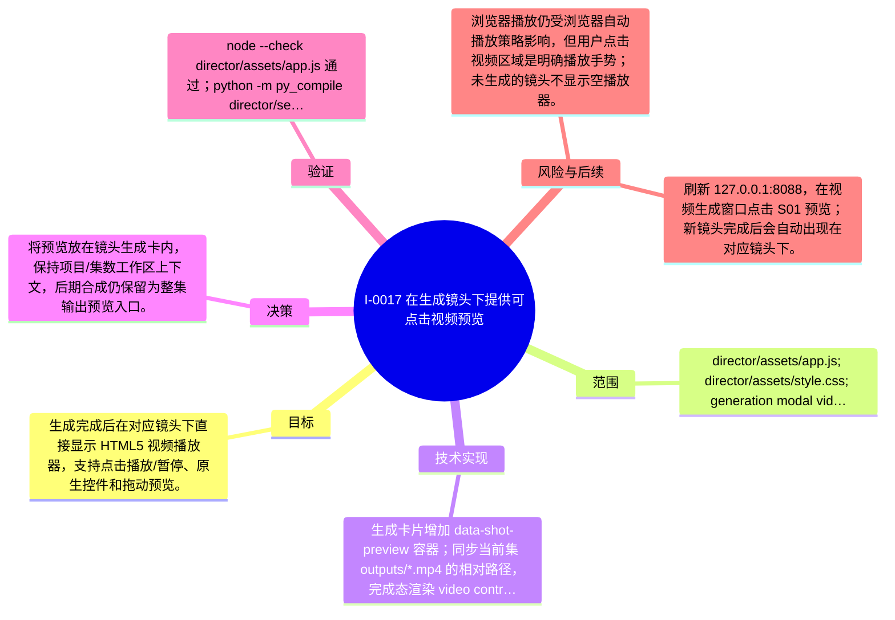

# I-0017 · 在生成镜头下提供可点击视频预览

## 结果摘要

生成完成后在对应镜头下直接显示 HTML5 视频播放器，支持点击播放/暂停、原生控件和拖动预览。

## 迭代脑图

## 目标与范围

### 范围

- director/assets/app.js; director/assets/style.css; generation modal video preview

### 非目标

- 不改变视频生成任务、ComfyUI 工作流和输出文件格式，不新增生成任务。

## 变更文件与职责

| 文件 | 本迭代职责/关键符号 |
|---|---|
| `director/assets/app.js` | `data-shot-preview`、`updateGenerationRow`：把完成镜头的输出路径渲染成可播放视频并绑定点击播放/暂停 |
| `director/assets/style.css` | `.generation-preview`、`.generation-video`：控制镜头预览尺寸和播放器样式 |

## 技术实现

- 生成卡片增加 data-shot-preview 容器；同步当前集 outputs/*.mp4 的相对路径，完成态渲染 video controls/playsinline/preload=metadata，并绑定视频区域点击播放/暂停；任务 result.clip 作为新完成任务的回退路径。

补充时至少覆盖：入口、关键符号、控制流/数据流、接口或 schema、状态与错误、配置、兼容性、测试缝。

## 决策

- 将预览放在镜头生成卡内，保持项目/集数工作区上下文，后期合成仍保留为整集输出预览入口。

如存在长期影响且有真实替代方案，请创建并链接 ADR。

## 验证证据

- node --check director/assets/app.js 通过；python -m py_compile director/serve.py 通过；git diff --check 通过；/api/files 返回 ep01 outputs/S01.mp4；/api/media HEAD 返回 200、Content-Type video/mp4、Content-Length 652790；浏览器刷新后 generation-video 数量为 1，点击后 paused=false、currentTime=0.98。

## 风险与技术债

- 浏览器播放仍受浏览器自动播放策略影响，但用户点击视频区域是明确播放手势；未生成的镜头不显示空播放器。

## 下一步

- 刷新 127.0.0.1:8088，在视频生成窗口点击 S01 预览；新镜头完成后会自动出现在对应镜头下。

## 追溯信息

- 记录时间：`2026-09-01T17:36:07+08:00`
- Git 分支：`main`
- Git 提交：`a0caad0c01b2015cfd57094f7a166924bea66445`
- 文档生成器：`project_docs.py 1.0.0`
