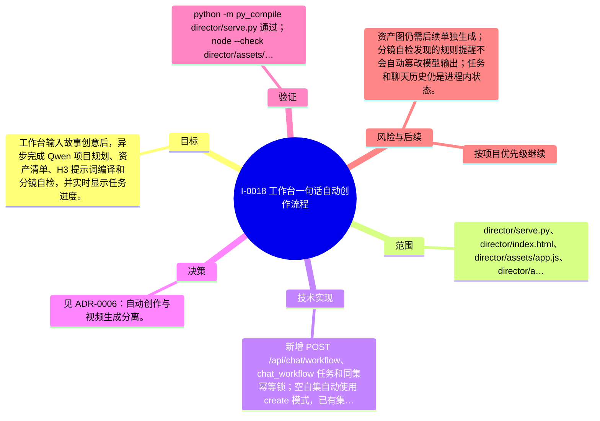

# I-0018 · 工作台一句话自动创作流程

## 结果摘要

工作台输入故事创意后，异步完成 Qwen 项目规划、资产清单、H3 提示词编译和分镜自检，并实时显示任务进度。

## 迭代脑图

## 目标与范围

### 范围

- director/serve.py、director/index.html、director/assets/app.js、director/assets/style.css、README.md、docs/PROJECT_ANALYSIS.md 与 project-evolution 文档

### 非目标

- 未声明

## 变更文件与职责

| 文件 | 本迭代职责/关键符号 |
|---|---|
| `README.md` | 待补充职责与具体符号 |
| `director/assets/app.js` | 待补充职责与具体符号 |
| `director/assets/style.css` | 待补充职责与具体符号 |
| `director/index.html` | 待补充职责与具体符号 |
| `director/serve.py` | 待补充职责与具体符号 |
| `docs/PROJECT_ANALYSIS.md` | 待补充职责与具体符号 |
| `projects/new_project/episodes/ep01/assets/asset-plan.json` | 待补充职责与具体符号 |
| `projects/new_project/episodes/ep01/episode.json` | 待补充职责与具体符号 |
| `projects/new_project/episodes/ep01/prompts/S01.txt` | 待补充职责与具体符号 |
| `projects/new_project/episodes/ep01/prompts/S02.txt` | 待补充职责与具体符号 |
| `projects/new_project/episodes/ep01/prompts/S03.txt` | 待补充职责与具体符号 |
| `projects/new_project/episodes/ep01/prompts/S04.txt` | 待补充职责与具体符号 |
| `projects/new_project/episodes/ep01/prompts/S05.txt` | 待补充职责与具体符号 |
| `projects/new_project/project.json` | 待补充职责与具体符号 |

## 技术实现

- 新增 POST /api/chat/workflow、chat_workflow 任务和同集幂等锁；空白集自动使用 create 模式，已有集使用 iterate 模式；写入 assets/asset-plan.json 和 prompts/S*.txt；前端轮询 task id 显示 cur/total 与最新日志。

补充时至少覆盖：入口、关键符号、控制流/数据流、接口或 schema、状态与错误、配置、兼容性、测试缝。

## 决策

- 见 ADR-0006：自动创作与视频生成分离。

如存在长期影响且有真实替代方案，请创建并链接 ADR。

## 验证证据

- python -m py_compile director/serve.py 通过；node --check director/assets/app.js 通过；HTTP 首页 200；真实任务 15521d65ef 完成 5/5，生成 5 镜头、2 角色、1 场景、5 个提示词；Qwen /v1/models 与 ComfyUI /system_stats 均返回 200；分镜检查发现 1 条收尾 hook 提醒并在任务结果中保留。

## 风险与技术债

- 资产图仍需后续单独生成；分镜自检发现的规则提醒不会自动篡改模型输出；任务和聊天历史仍是进程内状态。

## 下一步

- 按项目优先级继续

## 追溯信息

- 记录时间：`2026-09-01T18:32:51+08:00`
- Git 分支：`main`
- Git 提交：`fc328b6e0809f92bbdfbee161a57c8c266bda89e`
- 文档生成器：`project_docs.py 1.0.0`
