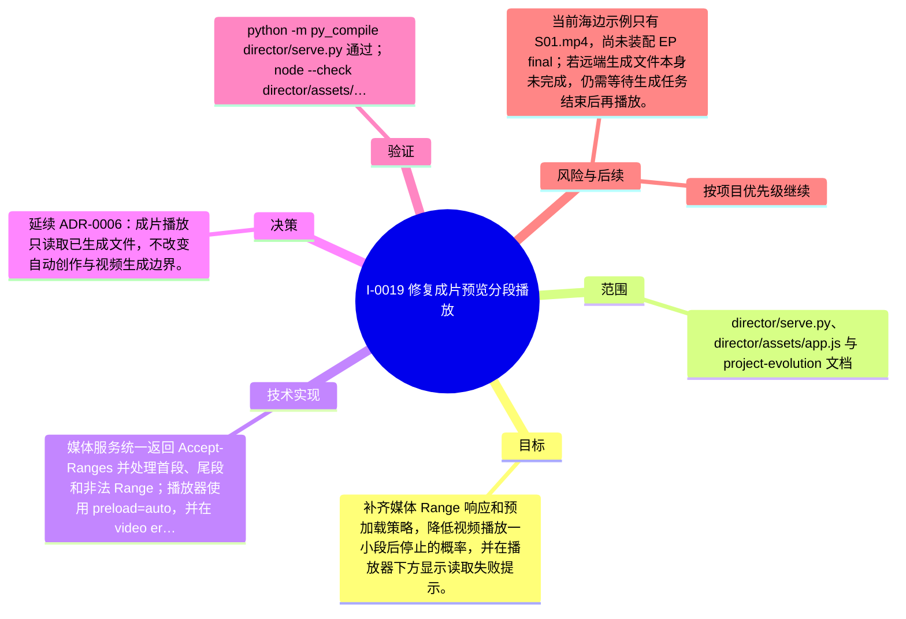

# I-0019 · 修复成片预览分段播放

## 结果摘要

补齐媒体 Range 响应和预加载策略，降低视频播放一小段后停止的概率，并在播放器下方显示读取失败提示。

## 迭代脑图

## 目标与范围

### 范围

- director/serve.py、director/assets/app.js 与 project-evolution 文档

### 非目标

- 未声明

## 变更文件与职责

| 文件 | 本迭代职责/关键符号 |
|---|---|
| `director/assets/app.js` | 待补充职责与具体符号 |
| `director/serve.py` | 待补充职责与具体符号 |
| `projects/new_project/episodes/ep01/outputs/S01.mp4` | 待补充职责与具体符号 |

## 技术实现

- 媒体服务统一返回 Accept-Ranges 并处理首段、尾段和非法 Range；播放器使用 preload=auto，并在 video error 事件中显示可见提示。

补充时至少覆盖：入口、关键符号、控制流/数据流、接口或 schema、状态与错误、配置、兼容性、测试缝。

## 决策

- 延续 ADR-0006：成片播放只读取已生成文件，不改变自动创作与视频生成边界。

如存在长期影响且有真实替代方案，请创建并链接 ADR。

## 验证证据

- python -m py_compile director/serve.py 通过；node --check director/assets/app.js 通过；ffmpeg 完整解码 projects/new_project/episodes/ep01/outputs/S01.mp4 通过；HTTP 首段和尾段 Range 均返回 206；首页返回 200；浏览器确认成片预览 video 数量为 1 且 preload=auto。

## 风险与技术债

- 当前海边示例只有 S01.mp4，尚未装配 EP final；若远端生成文件本身未完成，仍需等待生成任务结束后再播放。

## 下一步

- 按项目优先级继续

## 追溯信息

- 记录时间：`2026-09-01T18:46:27+08:00`
- Git 分支：`main`
- Git 提交：`38ed3166422803ad5ca62748ac751f03d677b1b8`
- 文档生成器：`project_docs.py 1.0.0`
