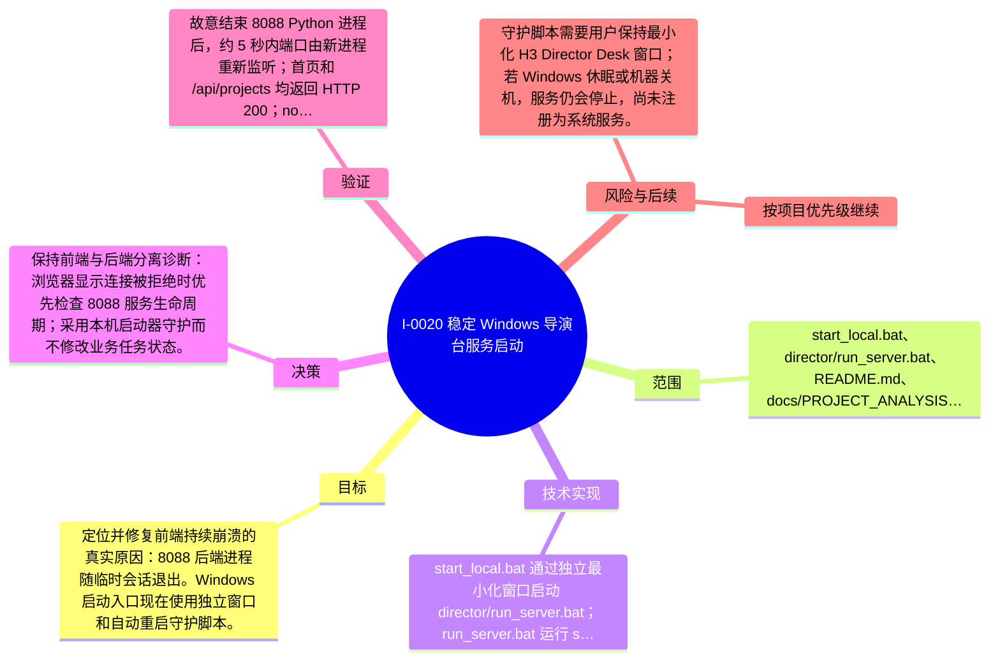

# I-0020 · 稳定 Windows 导演台服务启动

## 结果摘要

定位并修复前端持续崩溃的真实原因：8088 后端进程随临时会话退出。Windows 启动入口现在使用独立窗口和自动重启守护脚本。

## 迭代脑图

## 目标与范围

### 范围

- start_local.bat、director/run_server.bat、README.md、docs/PROJECT_ANALYSIS.md 与 project-evolution 文档

### 非目标

- 未声明

## 变更文件与职责

| 文件 | 本迭代职责/关键符号 |
|---|---|
| `README.md` | 待补充职责与具体符号 |
| `docs/PROJECT_ANALYSIS.md` | 待补充职责与具体符号 |
| `start_local.bat` | 待补充职责与具体符号 |
| `director/run_server.bat` | 待补充职责与具体符号 |

## 技术实现

- start_local.bat 通过独立最小化窗口启动 director/run_server.bat；run_server.bat 运行 serve.py，异常退出后记录 server.log 并在 2 秒后重启；server.log 被 Git 忽略。

补充时至少覆盖：入口、关键符号、控制流/数据流、接口或 schema、状态与错误、配置、兼容性、测试缝。

## 决策

- 保持前端与后端分离诊断：浏览器显示连接被拒绝时优先检查 8088 服务生命周期；采用本机启动器守护而不修改业务任务状态。

如存在长期影响且有真实替代方案，请创建并链接 ADR。

## 验证证据

- 故意结束 8088 Python 进程后，约 5 秒内端口由新进程重新监听；首页和 /api/projects 均返回 HTTP 200；node --check director/assets/app.js 与 python -m py_compile director/serve.py 通过；project_docs validate 通过。

## 风险与技术债

- 守护脚本需要用户保持最小化 H3 Director Desk 窗口；若 Windows 休眠或机器关机，服务仍会停止，尚未注册为系统服务。

## 下一步

- 按项目优先级继续

## 追溯信息

- 记录时间：`2026-09-01T20:03:31+08:00`
- Git 分支：`main`
- Git 提交：`2b87fae87808c2617608862ba0d0ce3f93b8cb07`
- 文档生成器：`project_docs.py 1.0.0`
