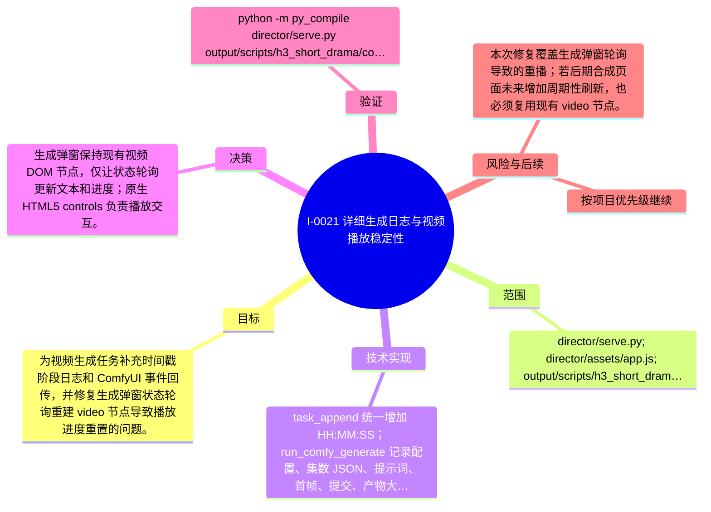

# I-0021 · 详细生成日志与视频播放稳定性

## 结果摘要

为视频生成任务补充时间戳阶段日志和 ComfyUI 事件回传，并修复生成弹窗状态轮询重建 video 节点导致播放进度重置的问题。

## 迭代脑图

## 目标与范围

### 范围

- director/serve.py; director/assets/app.js; output/scripts/h3_short_drama/comfyui_gen.py; docs/project-evolution

### 非目标

- 未声明

## 变更文件与职责

| 文件 | 本迭代职责/关键符号 |
|---|---|
| `director/assets/app.js` | `updateGenerationRow`、`syncGenerationStatus`：轮询更新状态并复用同 URL 的视频节点 |
| `director/serve.py` | `task_append`、`run_comfy_generate`：统一时间戳日志，记录生成阶段、目标服务和产物信息 |
| `output/scripts/h3_short_drama/comfyui_gen.py` | `generate`、`poll`：通过 `on_event` 回传 ComfyUI prompt、队列、重试和下载事件 |

## 技术实现

- task_append 统一增加 HH:MM:SS；run_comfy_generate 记录配置、集数 JSON、提示词、首帧、提交、产物大小、耗时和异常；comfyui_gen.generate/poll 通过 on_event 回传 prompt id、队列状态、瞬时失败、下载事件；updateGenerationRow 在媒体 URL 不变时复用现有 video 元素，并移除与原生 controls 冲突的自定义点击切换。

补充时至少覆盖：入口、关键符号、控制流/数据流、接口或 schema、状态与错误、配置、兼容性、测试缝。

## 决策

- 生成弹窗保持现有视频 DOM 节点，仅让状态轮询更新文本和进度；原生 HTML5 controls 负责播放交互。详见 [`ADR-0007`](../decisions/ADR-0007-生成状态轮询保持视频播放状态.md)。

如存在长期影响且有真实替代方案，请创建并链接 ADR。

## 验证证据

- python -m py_compile director/serve.py output/scripts/h3_short_drama/comfyui_gen.py；node --check director/assets/app.js；git diff --check；首页、/api/projects、/api/tasks、当前集 outputs API 均 HTTP 200；视频 Range 返回 206；S01.mp4 通过 ffmpeg 解码；浏览器新版页面加载并读取 S01/S02 预览，源码核验轮询同 URL 不重建 video 节点。

## 风险与技术债

- 本次修复覆盖生成弹窗轮询导致的重播；若后期合成页面未来增加周期性刷新，也必须复用现有 video 节点。

## 下一步

- 用户刷新页面后可在“视频生成”弹窗展开“查看日志”，观察完整阶段、队列状态和耗时；后续如增加成片轮询，同样复用已有视频节点。

## 追溯信息

- 记录时间：`2026-09-01T20:58:37+08:00`
- Git 分支：`main`
- Git 提交：`d7963db9b4f22326d864f744396b259f3cd4ac07`
- 文档生成器：`project_docs.py 1.0.0`
