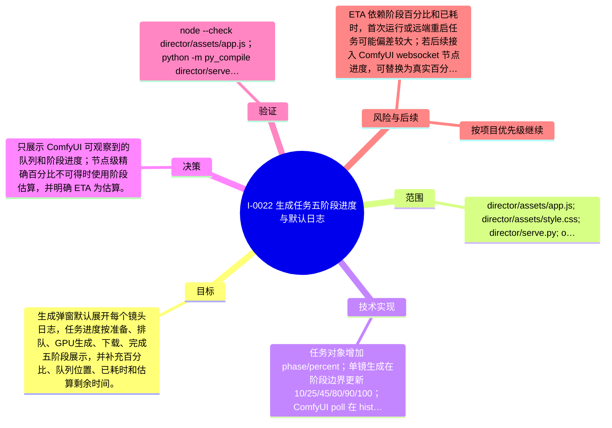

# I-0022 · 生成任务五阶段进度与默认日志

## 结果摘要

生成弹窗默认展开每个镜头日志，任务进度按准备、排队、GPU生成、下载、完成五阶段展示，并补充百分比、队列位置、已耗时和估算剩余时间。

## 迭代脑图

## 目标与范围

### 范围

- director/assets/app.js; director/assets/style.css; director/serve.py; output/scripts/h3_short_drama/comfyui_gen.py; docs/project-evolution

### 非目标

- 未声明

## 变更文件与职责

| 文件 | 本迭代职责/关键符号 |
|---|---|
| `director/assets/app.js` | 待补充职责与具体符号 |
| `director/assets/style.css` | 待补充职责与具体符号 |
| `director/serve.py` | 待补充职责与具体符号 |
| `output/scripts/h3_short_drama/comfyui_gen.py` | 待补充职责与具体符号 |

## 技术实现

- 任务对象增加 phase/percent；单镜生成在阶段边界更新 10/25/45/80/90/100；ComfyUI poll 在 history 未出现时探测 /queue pending/running；前端默认打开 details，按 task percent 渲染 aria progressbar，并用已耗时计算带估算标记的剩余时间。

补充时至少覆盖：入口、关键符号、控制流/数据流、接口或 schema、状态与错误、配置、兼容性、测试缝。

## 决策

- 只展示 ComfyUI 可观察到的队列和阶段进度；节点级精确百分比不可得时使用阶段估算，并明确 ETA 为估算。

如存在长期影响且有真实替代方案，请创建并链接 ADR。

## 验证证据

- node --check director/assets/app.js；python -m py_compile director/serve.py output/scripts/h3_short_drama/comfyui_gen.py；git diff --check；首页、/api/projects、/api/tasks、outputs API 均 HTTP 200；视频 Range 返回 206；S01.mp4 通过 ffmpeg 解码；浏览器实测 5 个日志 details 默认 open，已完成视频 100%，未提交镜头 0%，页面无 console error/warning。

## 风险与技术债

- ETA 依赖阶段百分比和已耗时，首次运行或远端重启任务可能偏差较大；若后续接入 ComfyUI websocket 节点进度，可替换为真实百分比。

## 下一步

- 按项目优先级继续

## 追溯信息

- 记录时间：`2026-09-01T21:18:32+08:00`
- Git 分支：`main`
- Git 提交：`5429138a3e71889a39c0e9490b418f20be3578db`
- 文档生成器：`project_docs.py 1.0.0`
