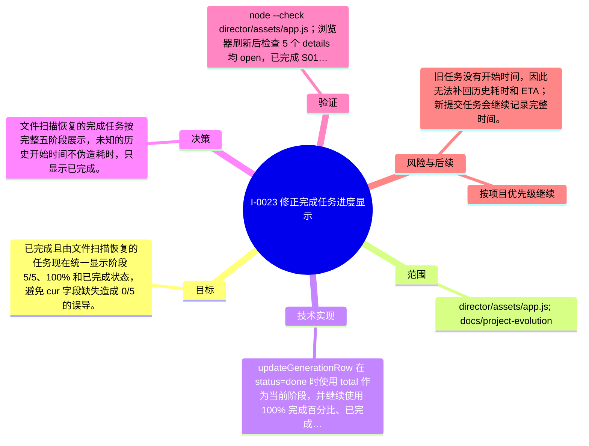

# I-0023 · 修正完成任务进度显示

## 结果摘要

已完成且由文件扫描恢复的任务现在统一显示阶段 5/5、100% 和已完成状态，避免 cur 字段缺失造成 0/5 的误导。

## 迭代脑图

## 目标与范围

### 范围

- director/assets/app.js; docs/project-evolution

### 非目标

- 未声明

## 变更文件与职责

| 文件 | 本迭代职责/关键符号 |
|---|---|
| `director/assets/app.js` | 待补充职责与具体符号 |

## 技术实现

- updateGenerationRow 在 status=done 时使用 total 作为当前阶段，并继续使用 100% 完成百分比、已完成 ETA 和原有视频节点复用逻辑。

补充时至少覆盖：入口、关键符号、控制流/数据流、接口或 schema、状态与错误、配置、兼容性、测试缝。

## 决策

- 文件扫描恢复的完成任务按完整五阶段展示，未知的历史开始时间不伪造耗时，只显示已完成。

如存在长期影响且有真实替代方案，请创建并链接 ADR。

## 验证证据

- node --check director/assets/app.js；浏览器刷新后检查 5 个 details 均 open，已完成 S01/S02 显示 阶段 5/5 · 100% · 已完成；/api 页面服务正常。

## 风险与技术债

- 旧任务没有开始时间，因此无法补回历史耗时和 ETA；新提交任务会继续记录完整时间。

## 下一步

- 按项目优先级继续

## 追溯信息

- 记录时间：`2026-09-01T21:23:21+08:00`
- Git 分支：`main`
- Git 提交：`34103f273509593c5957486a30acb6c6b7bed83e`
- 文档生成器：`project_docs.py 1.0.0`
