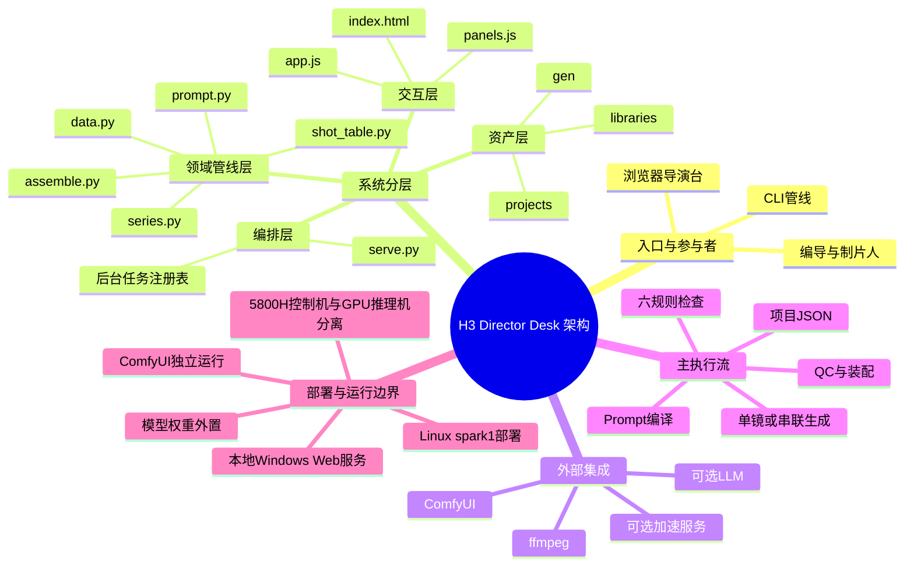

# 架构脑图

## 组件职责与依赖

| 组件 | 职责 | 上游 | 下游 | 代码证据 |
|---|---|---|---|---|
| Director Desk | 组织 10 个阶段，提供项目编辑、任务和媒体预览 | 浏览器 | `serve.py` API | [`director/assets/app.js`](../../director/assets/app.js)、[`director/assets/panels.js`](../../director/assets/panels.js) |
| HTTP 编排层 | 静态文件、JSON API、后台长任务 | 前端/CLI | 领域管线与文件系统 | [`director/serve.py`](../../director/serve.py) 的 `Handler`、`new_task` |
| H3 领域管线 | 校验分镜、编译提示词、生成和装配 | 项目 JSON | ComfyUI、ffmpeg、输出目录 | [`output/scripts/h3_short_drama/`](../../output/scripts/h3_short_drama/) |
| 项目资产 | 保存 Bible、角色卡、场景卡、镜头和媒体 | 用户/管线 | JSON、图片、视频 | [`projects/`](../../projects/)、[`gen/`](../../gen/) |

## 主流程

1. 浏览器访问 `director/serve.py`，或 CLI 直接读取项目 JSON。
2. 项目进入 `check`、`prompts`、`plan` 等纯计算阶段。
3. 生成、串联和装配作为后台任务执行，返回 task id。
4. 结果落盘到项目输出目录，再由 QC 和媒体接口读取。

## 架构约束

- JSON 是项目事实源；运行中的任务状态保存在内存任务表中。
- 有首帧/I2V 的镜头优先使用 ComfyUI；可选加速服务主要承担纯 T2V。
- 生成服务、模型权重、ffmpeg 和外部 LLM 不属于仓库内部部署内容。
