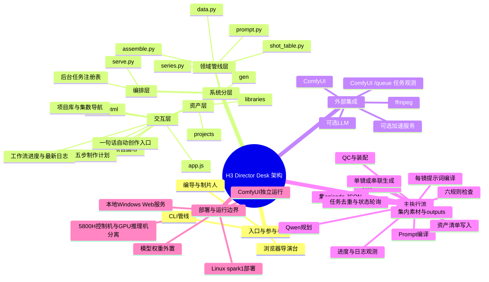

# 架构脑图

## 组件职责与依赖

| 组件 | 职责 | 上游 | 下游 | 代码证据 |
|---|---|---|---|---|
| Director Desk | 组织 10 个阶段，提供项目编辑、任务和媒体预览 | 浏览器 | `serve.py` API | [`director/assets/app.js`](../../director/assets/app.js)、[`director/assets/panels.js`](../../director/assets/panels.js) |
| HTTP 编排层 | 静态文件、JSON API、后台长任务、生成任务去重 | 前端/CLI | 领域管线、文件系统、ComfyUI 队列 | [`director/serve.py`](../../director/serve.py) 的 `Handler`、`new_task`、`remote_generations` |
| H3 领域管线 | 校验分镜、编译提示词、生成和装配 | 项目 JSON | ComfyUI、ffmpeg、输出目录 | [`output/scripts/h3_short_drama/`](../../output/scripts/h3_short_drama/) |
| 项目资产 | 按项目/集保存 Bible、角色卡、场景卡、镜头和媒体 | 用户/管线 | JSON、图片、视频 | [`projects/`](../../projects/)、[`gen/`](../../gen/) |

## 主流程

1. 浏览器访问 `director/serve.py`，从 `projects/*/project.json` 构建项目库。
2. 选择项目中的 `episodes/*/episode.json`，工作台只加载当前集的 JSON 与素材。
3. 工作台创意输入进入后台 `chat_workflow`：Qwen 生成项目 JSON，随后写入资产清单、编译 prompts 并执行六规则检查。
4. 当前集也可单独进入 `check`、`prompts`、`plan` 等纯计算阶段。
5. 生成、串联、装配和自动创作作为后台任务执行，返回 task id。
6. 生成提交前同时核对导演台任务表和 ComfyUI `/queue`；前端轮询任务并定时刷新远端队列。
7. 结果落盘到当前集的 `outputs/`，再由 QC 和媒体接口读取。

## 架构约束

- JSON 是项目事实源；导演台任务状态保存在内存任务表中，远端 ComfyUI 队列作为生成去重和重启恢复的补充事实源。
- 有首帧/I2V 的镜头优先使用 ComfyUI；可选加速服务主要承担纯 T2V。
- 生成服务、模型权重、ffmpeg 和外部 LLM 不属于仓库内部部署内容。
- 自动创作只提交文本给 Qwen；资产图和视频生成仍是显式的后续操作。
