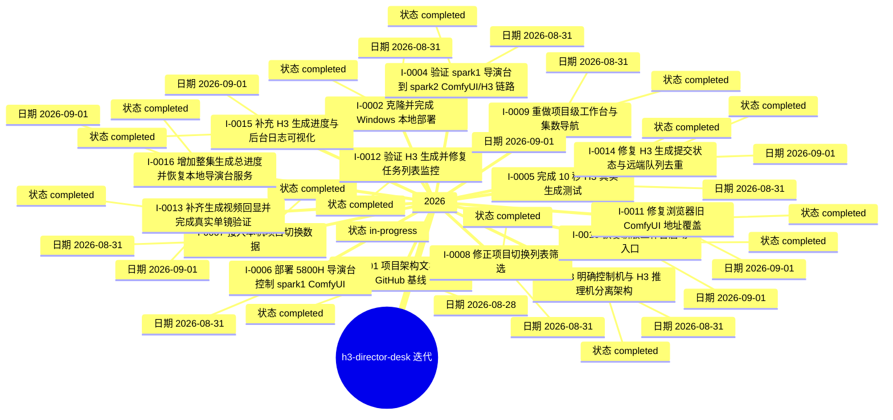

# 迭代脑图

> 本文件由迭代记录自动生成。完成的迭代记录是历史事实来源。

## 迭代索引

| 迭代 | 日期 | 状态 | 标题 |
|---|---|---|---|
| [I-0016](../iterations/I-0016-增加整集生成总进度并恢复本地导演台服务.md) | 2026-09-01 | completed | 增加整集生成总进度并恢复本地导演台服务 |
| [I-0015](../iterations/I-0015-补充-h3-生成进度与后台日志可视化.md) | 2026-09-01 | completed | 补充 H3 生成进度与后台日志可视化 |
| [I-0014](../iterations/I-0014-修复-h3-生成提交状态与远端队列去重.md) | 2026-09-01 | completed | 修复 H3 生成提交状态与远端队列去重 |
| [I-0013](../iterations/I-0013-补齐生成视频回显并完成真实单镜验证.md) | 2026-09-01 | completed | 补齐生成视频回显并完成真实单镜验证 |
| [I-0012](../iterations/I-0012-验证-h3-生成并修复任务列表监控.md) | 2026-09-01 | completed | 验证 H3 生成并修复任务列表监控 |
| [I-0011](../iterations/I-0011-修复浏览器旧-comfyui-地址覆盖.md) | 2026-09-01 | completed | 修复浏览器旧 ComfyUI 地址覆盖 |
| [I-0010](../iterations/I-0010-恢复新版工作台启动入口.md) | 2026-09-01 | completed | 恢复新版工作台启动入口 |
| [I-0009](../iterations/I-0009-重做项目级工作台与集数导航.md) | 2026-08-31 | completed | 重做项目级工作台与集数导航 |
| [I-0008](../iterations/I-0008-修正项目切换列表筛选.md) | 2026-08-31 | completed | 修正项目切换列表筛选 |
| [I-0007](../iterations/I-0007-接入本机项目切换数据.md) | 2026-08-31 | completed | 接入本机项目切换数据 |
| [I-0006](../iterations/I-0006-部署-5800h-导演台控制-spark1-comfyui.md) | 2026-08-31 | in-progress | 部署 5800H 导演台控制 spark1 ComfyUI |
| [I-0005](../iterations/I-0005-完成-10-秒-h3-真实生成测试.md) | 2026-08-31 | completed | 完成 10 秒 H3 真实生成测试 |
| [I-0004](../iterations/I-0004-验证-spark1-导演台到-spark2-comfyui-h3-链路.md) | 2026-08-31 | completed | 验证 spark1 导演台到 spark2 ComfyUI/H3 链路 |
| [I-0003](../iterations/I-0003-明确控制机与-h3-推理机分离架构.md) | 2026-08-31 | completed | 明确控制机与 H3 推理机分离架构 |
| [I-0002](../iterations/I-0002-克隆并完成-windows-本地部署.md) | 2026-08-31 | completed | 克隆并完成 Windows 本地部署 |
| [I-0001](../iterations/I-0001-项目架构文档与-github-基线.md) | 2026-08-28 | completed | 项目架构文档与 GitHub 基线 |
