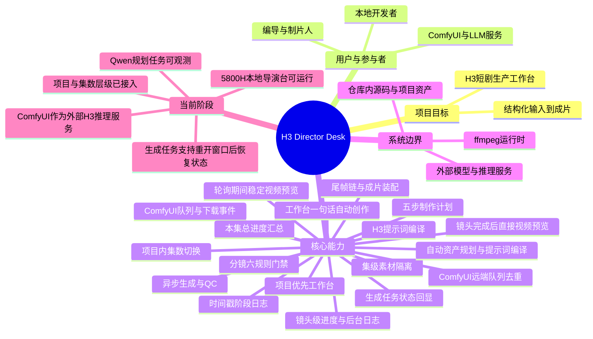

# 项目总览脑图

## 项目事实

| 项目 | 内容 | 证据 |
|---|---|---|
| 目标 | 将短剧创作到视频装配组织成可执行闭环 | [`README.md`](../../README.md)、[`director/README.md`](../../director/README.md) |
| 主要用户 | 编导/制片人和需要复用 H3 管线的开发者 | 导演台界面与 CLI 入口 |
| 核心能力 | 项目/集数工作台、分镜门禁、Prompt 编译、生成、QC、装配、任务状态回显与去重 | [`director/assets/app.js`](../../director/assets/app.js)、[`director/serve.py`](../../director/serve.py) |
| 非目标 | 不包含模型权重、ComfyUI 本体和自动化部署平台 | 运行环境说明与外部依赖 |

## 阅读提示

先阅读本页和 [`docs/PROJECT_ANALYSIS.md`](../../PROJECT_ANALYSIS.md)，再查看架构图和技术实现图。仓库事实以源码、配置和已执行命令为准。
