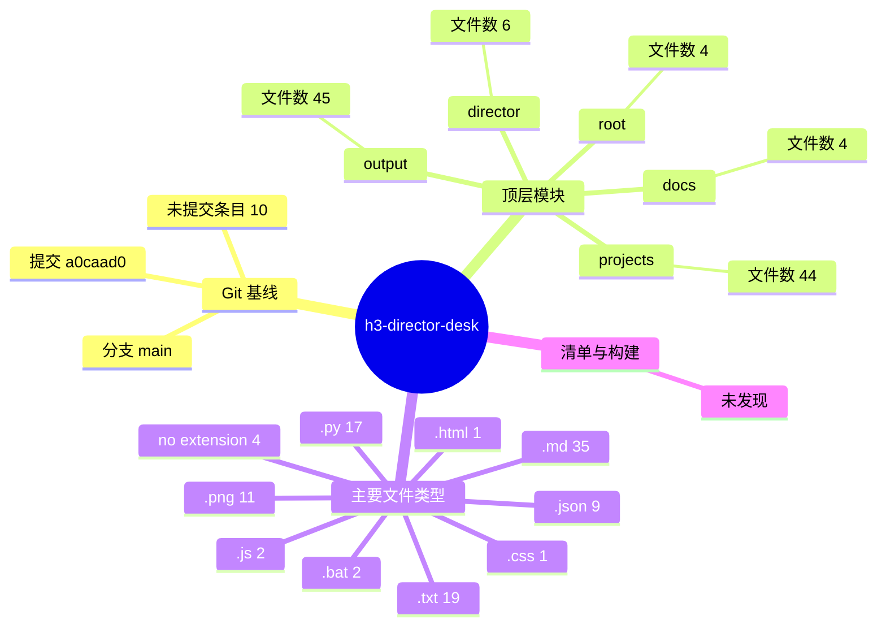

# 仓库结构脑图

> 本文件由脚本生成；语义架构请维护在 `architecture.md`。

```mermaid
mindmap
  root((h3-director-desk))
    Git 基线
      分支 main
      提交 a0caad0
      未提交条目 10
    顶层模块
      output
        文件数 45
      projects
        文件数 44
      director
        文件数 6
      root
        文件数 4
      docs
        文件数 4
    主要文件类型
      .md 35
      .txt 19
      .py 17
      .png 11
      .json 9
      no extension 4
      .bat 2
      .js 2
      .html 1
      .css 1
    清单与构建
      未发现
```

## 说明

详细证据见 `../evidence/repository-snapshot.md`。
