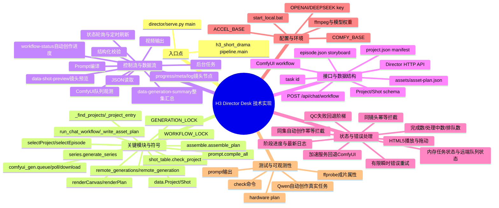

# 技术实现脑图

## 关键文件与符号

| 路径 | 符号/入口 | 职责 | 调用关系 | 验证 |
|---|---|---|---|---|
| `director/serve.py` | `main`、`Handler`、`run_*` | Web 服务和长任务编排 | Handler → 管线函数 → 文件/外部服务 | 已执行 API 与装配验证 |
| `director/assets/app.js` | `selectProject`、`selectEpisode`、`renderAll` | 项目库、集数状态和三栏工作台渲染 | `/api/projects`、`/api/project` → 当前工作台 | 浏览器 DOM 与截图验证 |
| `director/index.html` / `style.css` | 工作台壳与响应式样式 | 项目入口、画布、制作计划、对话框 | `app.js` | 浏览器首页 HTTP 200 |
| `output/scripts/h3_short_drama/data.py` | `Project`、`Shot`、`Reference`、`PerSecond` | 结构化领域模型 | JSON ↔ dataclass | 示例项目可加载 |
| `shot_table.py` | `check_project` 及规则函数 | 分镜硬门禁 | Project → errors | Odyssey check 通过 |
| `prompt.py` | `compile`、`compile_all` | Base/Ref2VA 提示词编译 | Shot + Project → text | ep01 prompt 编译通过 |
| `comfyui_gen.py` | `queue`、`poll`、`download` | ComfyUI 长任务生命周期 | workflow → mp4 | 已有 I2V 链路完成 |
| `series.py` / `assemble.py` | `generate_series`、`assemble_plan` | 尾帧链和 ffmpeg 装配 | clips → final mp4 | 成片属性已核验 |

## 接口、Schema 与事件

| 名称 | 类型 | 输入 | 输出 | 兼容性/错误 |
|---|---|---|---|---|
| `/api/director`、`/api/projects`、`/api/project` | GET | 项目库、当前集总览与集数读取 | JSON；路径受限于仓库根目录 | 不存在项目返回错误 |
| `/api/stage/check`、`prompts`、`plan`、`qc` | GET | 检查、编译、规划、QC | JSON 或文件列表 | 纯读取/计算 |
| `/api/stage/generate`、`series`、`assemble` | POST | 启动长任务 | task id 或 existing | 生成先检查内存任务与 ComfyUI `/queue`；后台执行，失败写 task error |
| `/api/chat/workflow` | POST | `{path, mode: auto|create|iterate, feedback}` | task id | 后台完成 Qwen 项目 JSON、`assets/asset-plan.json`、`prompts/S*.txt` 与分镜自检；同一集运行中返回 existing |
| `/api/tasks` | GET | 当前导演台任务与 ComfyUI 队列 | 任务列表、最近 8 条日志 | 兼容历史无路径任务，远端任务标记 `remote`，队列任务包含位置 |
| `/api/stage/save_project`、`patch` | POST | 整体或局部保存 | JSON | 直接落盘项目文件 |
| `Project/Shot` schema | JSON | 描述短剧和镜头 | dataclass | 未知字段在 `Shot.from_dict` 中忽略 |

## 运行机制

- 状态与生命周期：自动创作、生成/串联/装配由后台线程执行，task id 作为前后端关联键；工作台 composer 显示自动创作的 `cur/total` 与最新日志，生成窗口按集数和镜头维护状态，避免重复轮询。
- 工作台状态：浏览器保存当前项目/集数路径；切换时清空旧集状态并重新请求 `episode.json` 与 `/api/director`。
- 并发、队列或缓存：使用进程内任务注册表；自动创作通过 `WORKFLOW_LOCK` 阻止同一集重复提交；生成入口查询 ComfyUI `/queue` 识别服务重启后的远端任务；聊天会话仍主要在内存中。
- 错误、重试与降级：ComfyUI 对瞬时网络错误有限重试；加速服务的 I2V 自动回退 ComfyUI。
- 配置与环境变量：ComfyUI 地址、加速地址、LLM 地址/模型和密钥均来自环境或命令行；文档不记录密钥值。
- 测试缝与可观测性：`check`、`plan`、`prompts`、HTTP API、ffprobe 属性和真实装配结果构成当前验证证据。
