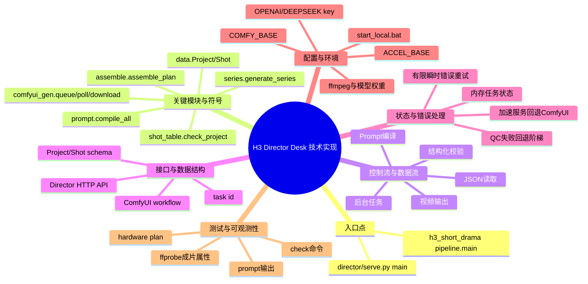

# 技术实现脑图

## 关键文件与符号

| 路径 | 符号/入口 | 职责 | 调用关系 | 验证 |
|---|---|---|---|---|
| `director/serve.py` | `main`、`Handler`、`run_*` | Web 服务和长任务编排 | Handler → 管线函数 → 文件/外部服务 | 已执行 API 与装配验证 |
| `output/scripts/h3_short_drama/data.py` | `Project`、`Shot`、`Reference`、`PerSecond` | 结构化领域模型 | JSON ↔ dataclass | 示例项目可加载 |
| `shot_table.py` | `check_project` 及规则函数 | 分镜硬门禁 | Project → errors | Odyssey check 通过 |
| `prompt.py` | `compile`、`compile_all` | Base/Ref2VA 提示词编译 | Shot + Project → text | ep01 prompt 编译通过 |
| `comfyui_gen.py` | `queue`、`poll`、`download` | ComfyUI 长任务生命周期 | workflow → mp4 | 已有 I2V 链路完成 |
| `series.py` / `assemble.py` | `generate_series`、`assemble_plan` | 尾帧链和 ffmpeg 装配 | clips → final mp4 | 成片属性已核验 |

## 接口、Schema 与事件

| 名称 | 类型 | 输入 | 输出 | 兼容性/错误 |
|---|---|---|---|---|
| `/api/director`、`/api/projects`、`/api/project` | GET | 总览与项目读取 | JSON；路径受限于仓库根目录 | 不存在项目返回错误 |
| `/api/stage/check`、`prompts`、`plan`、`qc` | GET | 检查、编译、规划、QC | JSON 或文件列表 | 纯读取/计算 |
| `/api/stage/generate`、`series`、`assemble` | POST | 启动长任务 | task id | 后台执行，失败写 task error |
| `/api/stage/save_project`、`patch` | POST | 整体或局部保存 | JSON | 直接落盘项目文件 |
| `Project/Shot` schema | JSON | 描述短剧和镜头 | dataclass | 未知字段在 `Shot.from_dict` 中忽略 |

## 运行机制

- 状态与生命周期：生成/串联/装配由后台线程执行，task id 作为前后端关联键。
- 并发、队列或缓存：使用进程内任务注册表，无持久化队列；聊天会话也主要在内存中。
- 错误、重试与降级：ComfyUI 对瞬时网络错误有限重试；加速服务的 I2V 自动回退 ComfyUI。
- 配置与环境变量：ComfyUI 地址、加速地址、LLM 地址/模型和密钥均来自环境或命令行；文档不记录密钥值。
- 测试缝与可观测性：`check`、`plan`、`prompts`、HTTP API、ffprobe 属性和真实装配结果构成当前验证证据。
