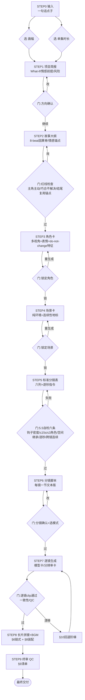
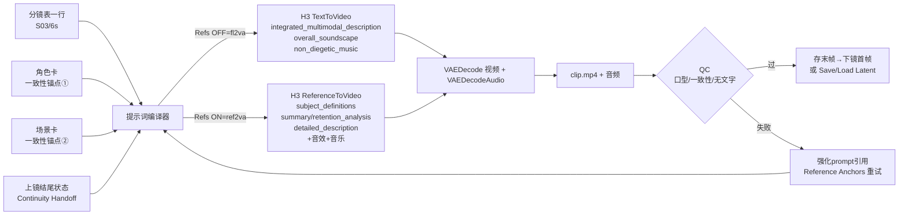
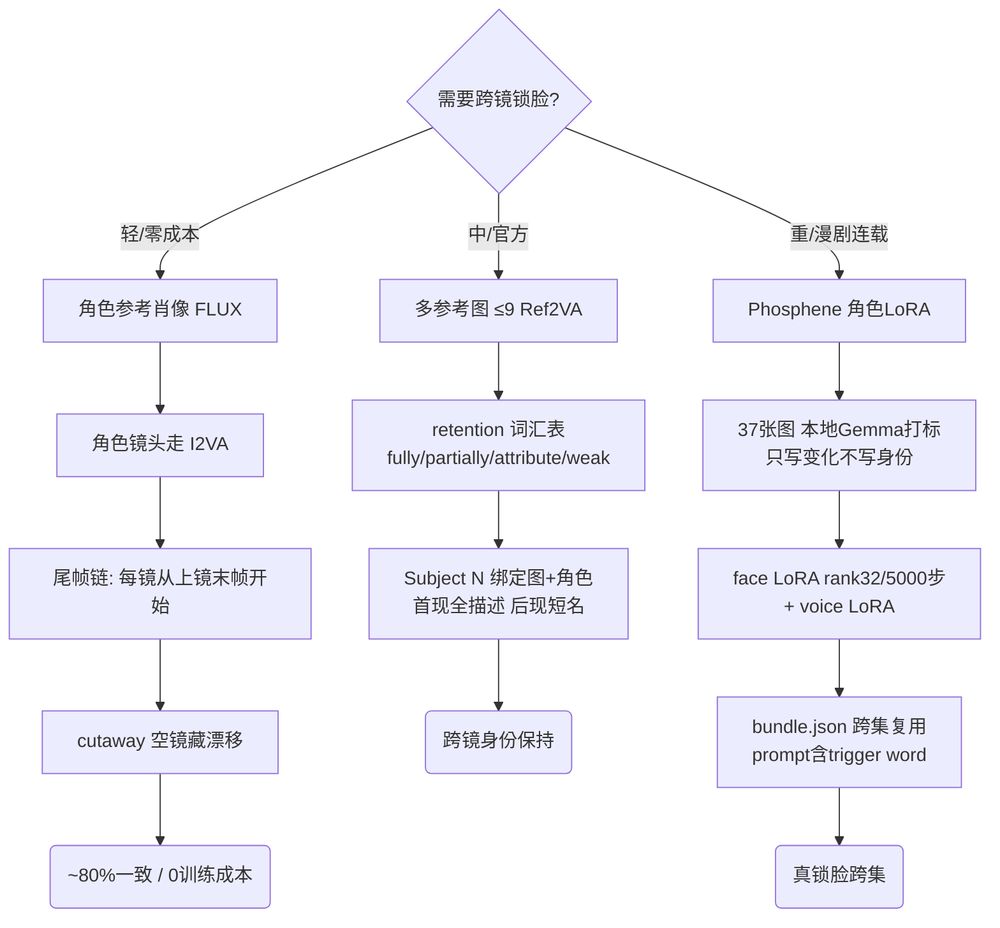
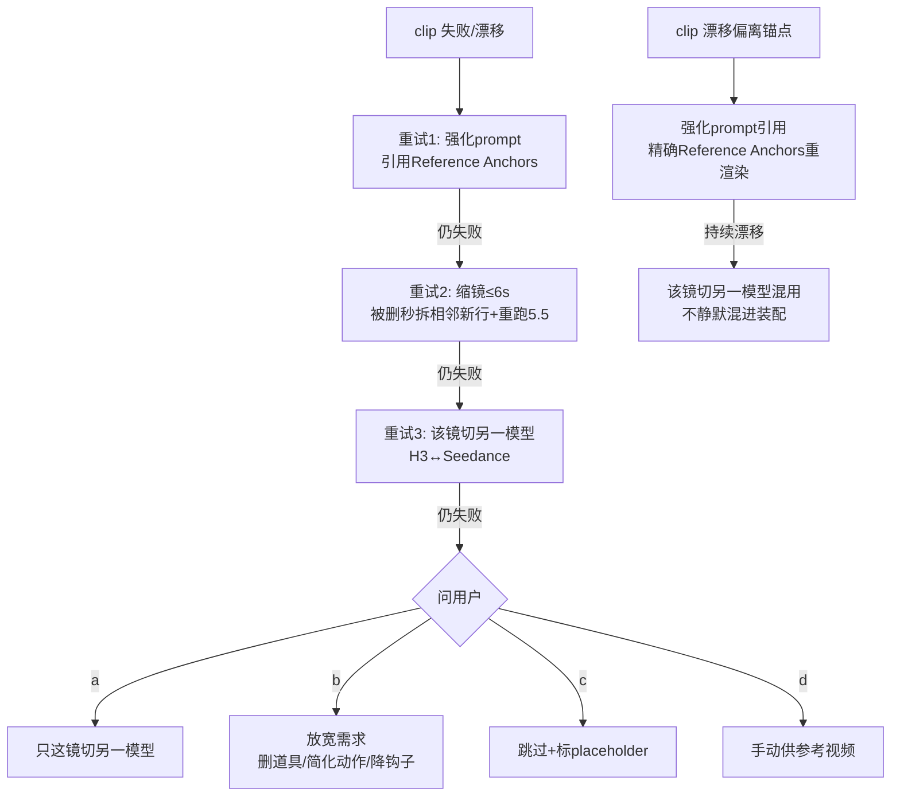
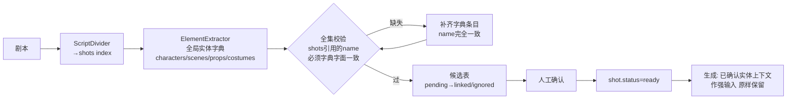

# H3 短剧生成 · 流程图 (FLOWCHART)

> 用 mermaid。可粘贴到任何 mermaid 渲染器。

## 1. 端到端 SOP（一集短剧）



## 2. 单镜数据流（分镜行 → H3 提示词 → 生成）



## 3. 长片链式拼接（latent 钉接，Motion-Context 内幕）

```mermaid
sequenceDiagram
    participant A as Clip A 采样
    participant SL as Save Latent
    participant MC as Motion Context 节点
    participant B as Clip B 采样
    participant TR as Trim
    A->>SL: 上段 AV latent (clip_00001)
    SL-->>MC: context_latent (尾22帧切片, bit-identical)
    MC->>MC: 钉成 0..21 never-denoised cond 行<br/>音频尾24帧 末端对齐接点(timeline语义)
    MC->>B: 强化 conditioning + trim_frames=22
    B->>TR: 解码 视频+音频
    TR->>TR: 裁前22帧 + match_tail(消±8.3ms累积)
    TR->>SL: clip_00002 (供下一镜续拍)
    Note over MC: 关 Turbo/Spectrum; 32kHz 拼接
```

## 4. 一致性双路线（不串戏）



## 5. 回退阶梯（单镜失败/漂移）



## 7. 人脸精修（FaceRefine，治 H3 小脸）

```mermaid
flowchart TD
    SRC[源 clip] --> TC[H3 Face Track+Crop<br/>crop_factor 2.5 / canvas 768<br/>smooth 21+51 gaussian<br/>identity_track 按身份选主体]
    TC -->|crops| INJ[H3 Inject Video Latent<br/>img2img: 真帧→视频流 latent<br/>音频流不动]
    TC -->|transform| PF
    TC -->|canvas_w/h| REF[MiniMaxH3ReferenceToVideo<br/>refs + 原 prompt]
    REF -->|av_latent| INJ
    VOC[分离人声] --> AL[MiniMaxH3NativeAudioLock<br/>音频流编码+noise_mask 视频1/音频0<br/>口型由此塑造]
    INJ --> AL
    TC -->|transform| PF[H3 Per-Frame Denoise<br/>小脸强(合成)/大脸轻(保留)<br/>strength 1.0/0.35 face_px 30/120]
    PF --> SAMP[SamplerCustomAdvanced<br/>BasicScheduler, 低denoise, 不用SplitSigmas]
    SAMP --> VAE[VAEDecode]
    VAE -->|refined_crops| ST[H3 Face Stitch Back<br/>只贴脸区+colour_match 1.0<br/>feather rect24/SAM4-8]
    SRC -->|base=原帧| ST
    OAO[原音频] --> SAVE[保存 final]
    ST --> SAVE
    NOTE[成本=canvas²×帧<br/>多人: 逐人串联 run1→run2 base]
```

## 8. 一致性检查（Jellyfish 全局字典法，纯 prompt 最稳）


